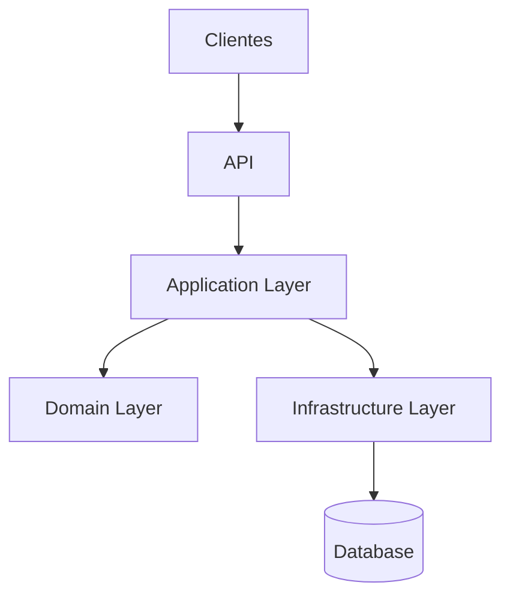

# 🚀 EmpregaNet API - Plataforma de Recrutamento Digital


## 🔍 Visão Geral

A **EmpregaNet API** é o coração de uma plataforma moderna de recrutamento, desenvolvida com:

- **ASP.NET Core 9**
- **Padrão CQRS**
- **Domain-Driven Design (DDD)**
- **Clean Architecture**


--- 

## Estrutura do Projeto

A solução `EmpregaNet.sln` é organizada em uma arquitetura de camadas, promovendo **separação de responsabilidades**, **facilidade de manutenção**, **testabilidade** e **escalabilidade**:

```
├── EmpregaNet.sln
├── EmpregaNet.Api/                  # 🖥️ Camada de Apresentação
│   ├── Configuration/               # Configurações do sistema
│   ├── Controllers/                 # Endpoints da API
│   ├── Middleware/                  # Middlewares customizados
│   ├── appsettings.Development.json
│   │── appsettings.json  
│   ├── Program.cs                   # Configuração inicial
│   └── EmpregaNet.Api.csproj
│
├── EmpregaNet.Application/          # 🧠 Lógica de Aplicação
│   ├── Common/                      # Objetos compartilhados
│   ├── Company/                     # Casos de uso de Empresas
│   ├── Job/                         # Casos de uso de Vagas
│   ├── Service/                     # Serviços da aplicação
│   ├── ViewModel/                   # Modelos de visualização
│   └── EmpregaNet.Application.csproj
│
├── EmpregaNet.Domain/               # 💡 Modelos de Domínio
│   ├── Entities/                    # Entidades do negócio
│   ├── Enums/                       # Enumerações
│   ├── Interfaces/                  # Contratos do domínio
│   └── EmpregaNet.Domain.csproj
│
├── EmpregaNet.Infra/                # 🔌 Infraestrutura
│   ├── Cache/                       # Implementações de cache
│   ├── Configurations/              # Configurações de banco
│   ├── Persistence/                 # Repositórios e DbContext
│   ├── Utils/                       # Utilitários
│   ├── DependencyInjection.cs       # Injeção de dependências
│   └── EmpregaNet.Infra.csproj
│
└── EmpregaNet.Tests/                # 🧪 Testes
    ├── IntegrationTests/
    ├── UnitTests/
    ├── dockerignore
    ├── .gitignore
    └── docker-compose.yml
```
---

## 📜 Licença
Distribuído sob licença MIT. Veja LICENSE para mais informações.