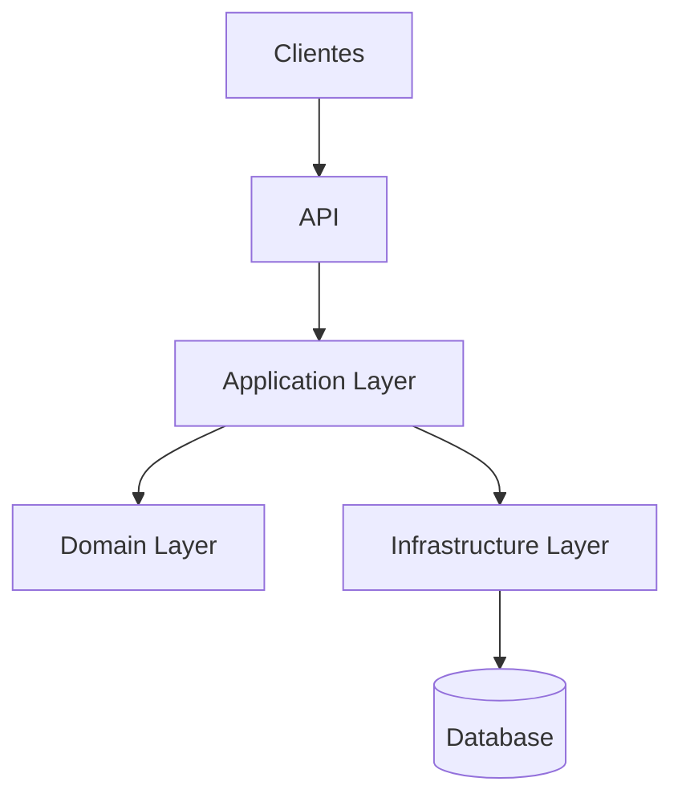

# 🚀 EmpregaNet API - Plataforma de Recrutamento Digital


## 🔍 Visão Geral

A **EmpregaNet API** é o coração de uma plataforma moderna de recrutamento, desenvolvida com:

- **ASP.NET Core 10**
- **Padrão CQRS**
- **Domain-Driven Design (DDD)**
- **Clean Architecture**

## Estrutura da Solução e Fluxo de Dependência

A estrutura da solução segue o **princípio da dependência de dentro para fora**.  
As camadas externas (BFF, Infraestrutura) dependem das camadas internas (Aplicação, Domínio), mas nunca o contrário.


### 1. Pré-requisitos

- [.NET SDK 10](https://dotnet.microsoft.com/download/dotnet/10.0) ou superior  
- Acesso e credenciais válidas para o **Postgres SQL** (via VPN ou rede local)

---

### 2. Configuração de Variáveis de Ambiente

O projeto utiliza variáveis de ambiente para a **Connection String**.  
Defina os seguintes valores em um arquivo `.env` ou nas configurações do seu IDE:

```bash
POSTGRES_PORT=5432
POSTGRES_HOST=""
POSTGRES_DB=""
POSTGRES_USER=""
POSTGRES_PASSWORD=""
```

> ⚠️ **Importante:**  
> Nunca versionar o arquivo `.env` no controle de versão (Git).

---

### 3. Como Rodar as APIs

Execute os comandos a partir da **raiz da solução** (onde está o arquivo `EmpregaNet.sln`):

| API | Comando de Execução | Endpoint Típico |
|------|----------------------|----------------|
| **BFF API (Web)** | `dotnet run --project Bff/BFF.WebApi` | [http://localhost:5134](http://localhost:5134/swagger/index.html) |
| **API** | `dotnet run --project src/EmpregaNet.Api` | [http://localhost:5065](http://localhost:5065/swagger/index.html) |

---

## 4. Migrações do Entity Framework Core

As migrações são gerenciadas pelo projeto **Infrastructure**, execute os comandos abaixo na **raiz da solução**:

### Criar uma Nova Migração

```bash
     No terminal via CLI navega para o path *src/EmpregaNet.Infra* e
     rode o comando *dotnet ef migrations add [NomeDescritivoDaMigracao]  --context PostgreSqlContext --output-dir Persistence/Migrations*
 ```

### Aplicar Migrações (Atualizar o Banco de Dados) 
```bash
    No terminal via CLI navega para o path *src/EmpregaNet.Infra* e 
    rode o comando *dotnet ef database update* 
```
---

## Execução com Docker Compose

O ambiente de desenvolvimento pode ser inicializado utilizando Docker Compose, que gerencia os serviços Redis, RedisInsight e a aplicação WebApp.
Certifique-se de ter o **Docker** e **Docker Compose** instalados.

### Como Executar

No terminal, execute o comando abaixo para **construir a imagem** (caso haja mudanças no Dockerfile) e iniciar todos os serviços em modo **detached** (segundo plano):

> docker compose up --build -d


### Após a Inicialização

Se as portas padrão forem usadas, as aplicações e ferramentas estarão acessíveis em:

- **BFF (Backend for Frontend):** [http://localhost:8080](http://localhost:8080)  
- **API (Core Service):** [http://localhost:8081](http://localhost:8081)  
- **RedisInsight (UI):** [http://localhost:5540](http://localhost:5540)  
---

### Comandos Úteis

- Para verificar o status dos containers:

```bash
docker compose ps
docker compose up -d
```

- Para parar os containers, execute:

```bash
docker compose down
```
---


```mermaid
graph TD
    A[Clientes] --> B[API]
    B --> C[Application Layer]
    C --> D[Domain Layer]
    C --> E[Infrastructure Layer]
    E --> F[(Database)]
```
--- 

## Estrutura do Projeto

A solução `EmpregaNet.sln` é organizada em uma arquitetura de camadas, promovendo **separação de responsabilidades**, **facilidade de manutenção**, **testabilidade** e **escalabilidade**:

```
├── EmpregaNet.sln
├── EmpregaNet.Api/                  # 🖥️ Camada de Apresentação
│   ├── Configuration/               # Configurações do sistema
│   ├── Controllers/                 # Endpoints da API
│   ├── Middleware/                  # Middlewares customizados
│   ├── appsettings.Development.json
│   │── appsettings.json  
│   ├── Program.cs                   # Configuração inicial
│   └── EmpregaNet.Api.csproj
│
├── EmpregaNet.Application/          # 🧠 Lógica de Aplicação
│   ├── Common/                      # Objetos compartilhados
│   ├── Company/                     # Casos de uso de Empresas
│   ├── Job/                         # Casos de uso de Vagas
│   ├── Service/                     # Serviços da aplicação
│   ├── ViewModel/                   # Modelos de visualização
│   └── EmpregaNet.Application.csproj
│
├── EmpregaNet.Domain/               # 💡 Modelos de Domínio
│   ├── Entities/                    # Entidades do negócio
│   ├── Enums/                       # Enumerações
│   ├── Interfaces/                  # Contratos do domínio
│   └── EmpregaNet.Domain.csproj
│
├── EmpregaNet.Infra/                # 🔌 Infraestrutura
│   ├── Cache/                       # Implementações de cache
│   ├── Configurations/              # Configurações de banco
│   ├── Persistence/                 # Repositórios e DbContext
│   ├── Utils/                       # Utilitários
│   ├── DependencyInjection.cs       # Injeção de dependências
│   └── EmpregaNet.Infra.csproj
│
└── EmpregaNet.Tests/                # 🧪 Testes
    ├── IntegrationTests/
    ├── UnitTests/
    ├── dockerignore
    ├── .gitignore
    └── docker-compose.yml
```
---

## 📜 Licença
Distribuído sob licença MIT. Veja LICENSE para mais informações.