# EmpregaNet / EmpregaUAI

> Plataforma de vagas de emprego e gestão de candidaturas, com foco inicial em toda a região do **Sul de minas**.
> Monorepo com API .NET 10 (Clean Architecture), BFF .NET e frontend Next.js 16.


---

## Índice

1. [Visão geral](#1-visão-geral)
2. [Principais funcionalidades](#2-principais-funcionalidades)
3. [Arquitetura da solução](#3-arquitetura-da-solução)
4. [Diagrama de arquitetura](#4-diagrama-de-arquitetura)
5. [Estrutura de pastas](#5-estrutura-de-pastas)
6. [Tecnologias utilizadas](#6-tecnologias-utilizadas)
7. [Padrões arquiteturais adotados](#7-padrões-arquiteturais-adotados)
8. [Modelo de dados](#8-modelo-de-dados)
9. [Autenticação e autorização](#9-autenticação-e-autorização)
10. [Fluxo de navegação](#10-fluxo-de-navegação)
11. [Fluxo de requisições HTTP](#11-fluxo-de-requisições-http)
12. [Organização das camadas do frontend](#12-organização-das-camadas-do-frontend)
13. [Principais módulos e responsabilidades](#13-principais-módulos-e-responsabilidades)
14. [Gerenciamento de estado](#14-gerenciamento-de-estado)
15. [Estratégia de cache](#15-estratégia-de-cache)
16. [Tratamento de erros e exceções](#16-tratamento-de-erros-e-exceções)
17. [Configurando o ambiente de desenvolvimento](#17-configurando-o-ambiente-de-desenvolvimento)
18. [Variáveis de ambiente](#18-variáveis-de-ambiente)
19. [Executando o projeto localmente](#19-executando-o-projeto-localmente)
20. [Testes](#20-testes)
21. [Build de produção e CI/CD](#21-build-de-produção-e-cicd)
22. [Convenções do projeto](#22-convenções-do-projeto)
23. [Dependências mais importantes](#23-dependências-mais-importantes)
24. [Boas práticas para novos desenvolvedores](#24-boas-práticas-para-novos-desenvolvedores)
25. [Observações e dicas (pontos que geram dúvida)](#25-observações-e-dicas-pontos-que-geram-dúvida)
26. [Melhorias recomendadas](#26-melhorias-recomendadas)
27. [Pontos que exigem validação manual](#27-pontos-que-exigem-validação-manual)
28. [Licença](#28-licença)

---

## 1. Visão geral

### Objetivo de negócio

O EmpregaNet (marca do produto no frontend: **EmpregaUAI**) conecta **candidatos** a **empresas** que
publicam vagas, e dá à **equipe de recrutamento** um pipeline para acompanhar candidaturas. O escopo é
regional, os metadados da aplicação apontam para a cidades do sul de minas, e a modelagem é orientada ao mercado
brasileiro (CPF/CNPJ, CEP com autofill via ViaCEP, UF, telefone e moeda em pt-BR).

### Problemas que resolve

| Problema | Como o sistema resolve |
| -------- | ---------------------- |
| Vagas espalhadas em grupos de mensagens e murais, sem histórico | Catálogo de vagas versionado no banco, com estado ativo/encerrado e exclusão lógica (auditoria preservada) |
| Candidato não sabe em que pé está a candidatura | `GET /api/jobapplications/mine` + tela "Minhas candidaturas" com status por candidatura |
| Recrutador perde o controle do funil | Listagem por vaga (`/api/jobapplications/job/{jobId}`) e mudança de status restrita à equipe de recrutamento |
| Empresa multi-recrutador precisa de isolamento | `User.EmployerCompanyId` + `IJobEmployerAccess`: recrutador/gestor só opera na empresa vinculada; Admin vê todas |
| Descoberta pública sem login (e SEO) | Segmento `(public)/vagas` sem guard, renderizado no servidor com `generateMetadata` por vaga |
| Abuso de endpoints públicos (custo e email bombing) | Rate limit global por token bucket + teto diário de e-mails por destinatário |

### Personas

| Persona | Papel (role) | O que faz |
| ------- | ------------ | --------- |
| Candidato | `Candidate` | Busca vagas, candidata-se, acompanha status, gerencia perfil e senha |
| Recrutador | `Recruiter` | Publica/edita/encerra vagas da própria empresa, move candidaturas no funil |
| Gestor | `Manager` | Mesmas capacidades do recrutador, com visão de gestão da área |
| Administrador | `Admin` | Gerencia usuários e empresas, acesso total, vê todas as vagas (inclusive encerradas/excluídas) |
| Visitante anônimo | — | Vê apenas o catálogo público de vagas ativas |

---

## 2. Principais funcionalidades

### Conta e autenticação
- Registro com **confirmação de e-mail obrigatória** (`SignIn.RequireConfirmedEmail = true`)
- Login por **e-mail ou nome de usuário** (o handler decide pela presença de `@`)
- Login social com **Google** (validação de `id_token` no servidor)
- Recuperação de senha (`forgot-password` → e-mail → `reset-password`)
- Reenvio de link de confirmação
- **Refresh token opaco com rotação** e detecção de reuso (revoga toda a árvore de tokens do usuário)
- Logout idempotente que revoga o refresh token e limpa os cookies
- Lockout de conta após 5 tentativas falhadas (5 minutos)
- Troca de senha autenticada, atualização de perfil e encerramento da própria conta (exclusão lógica)

### Vagas
- Catálogo público paginado com busca textual e filtro `isActive`
- Detalhe público de vaga com SSR + metadata dinâmica (Open Graph / Twitter Card)
- CRUD restrito à política `Recrutamento`
- Encerramento de vaga (`PUT /api/jobs/{id}/close`) — mantém o registro para histórico
- Seleção de empresas permitidas ao publicar (`GET /api/jobs/selectable-companies`)
- Visibilidade diferenciada: anônimo vê só ativas e não excluídas; equipe de recrutamento vê tudo

### Candidaturas
- Candidatura do usuário autenticado a uma vaga
- Listagem "minhas candidaturas" com filtro por status
- Listagem por vaga e listagem geral (equipe de recrutamento)
- Transição de status com regras de domínio na entidade (`JobApplication.ChangeStatus`)

### Administração
- Gestão de usuários: listagem/detalhe, atualização de tipo, exclusão lógica, filtro `isDeleted`
- Gestão de empresas: CRUD completo com validação de CNPJ/CPF e endereço
- Consulta de candidatos pela equipe de recrutamento

### Plataforma
- Swagger/OpenAPI (apenas Development e Staging), com tags ordenadas e enums documentados
- Health checks separados: `/health/live`, `/health/ready` e `/health` (compatibilidade)
- `X-Correlation-ID` propagado em resposta, logs, Sentry e payloads de erro
- Output Cache opt-in com invalidação por tag, backing store em Redis quando disponível
- Compressão Brotli/Gzip, cabeçalhos de segurança, CORS restrito com credenciais
- Rate limiting global com tabela de partições limitada e auto-limpa
- Observabilidade via Sentry (extensão para AWS CloudWatch presente, mas desativada)

---

## 3. Arquitetura da solução

O repositório é um **monorepo** com três aplicações independentes e uma pasta de documentação
viva (`docs/`, com o processo de Spec-Driven Development e os ADRs).

| Aplicação | Solução / gerenciador | Papel |
| --------- | --------------------- | ----- |
| `backend/` | `EmpregaNet.sln` (.NET 10) | API REST — domínio, casos de uso, persistência, autenticação |
| `Bff/` | `EmpregaNet.Bff.sln` (.NET 10) | Backend-for-Frontend de agregação — **ainda sem endpoints**; planejado como porta de entrada do app mobile |
| `frontend/` | `pnpm` (Next.js 16 App Router) | Interface web, SSR do catálogo público, RBAC de UI |

### Camadas do backend

```
EmpregaNet.Api          → Controllers, middlewares, configuração do pipeline HTTP, Swagger, Output Cache
EmpregaNet.Application  → Commands/Queries + Handlers, ViewModels, Validators, JWT, permissões
EmpregaNet.Infra        → EF Core (PostgreSQL), repositórios, Redis, SMTP, Identity, rate limiting, behaviors
EmpregaNet.Domain       → Entidades, enums, interfaces de repositório, mediator interno
EmpregaNet.AI           → Provider do cliente OpenAI (scaffold; sem agentes implementados)
```

O sentido das dependências é para dentro, com uma exceção conhecida (`Infra → Application`, necessária
porque os pipeline behaviors vivem em `Infra` e consomem exceções da `Application`):

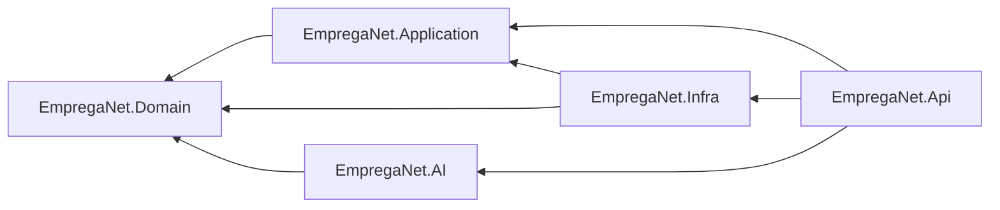
```mermaid
flowchart RL
  API["EmpregaNet.Api"]
  APP["EmpregaNet.Application"]
  INFRA["EmpregaNet.Infra"]
  DOMAIN["EmpregaNet.Domain"]
  AI["EmpregaNet.AI"]

  API --> APP
  API --> INFRA
  API --> AI
  INFRA --> APP
  INFRA --> DOMAIN
  APP --> DOMAIN
  AI --> DOMAIN
```

---

## 4. Diagrama de arquitetura

### 4.1 Visão de contêineres (C4 nível 2)

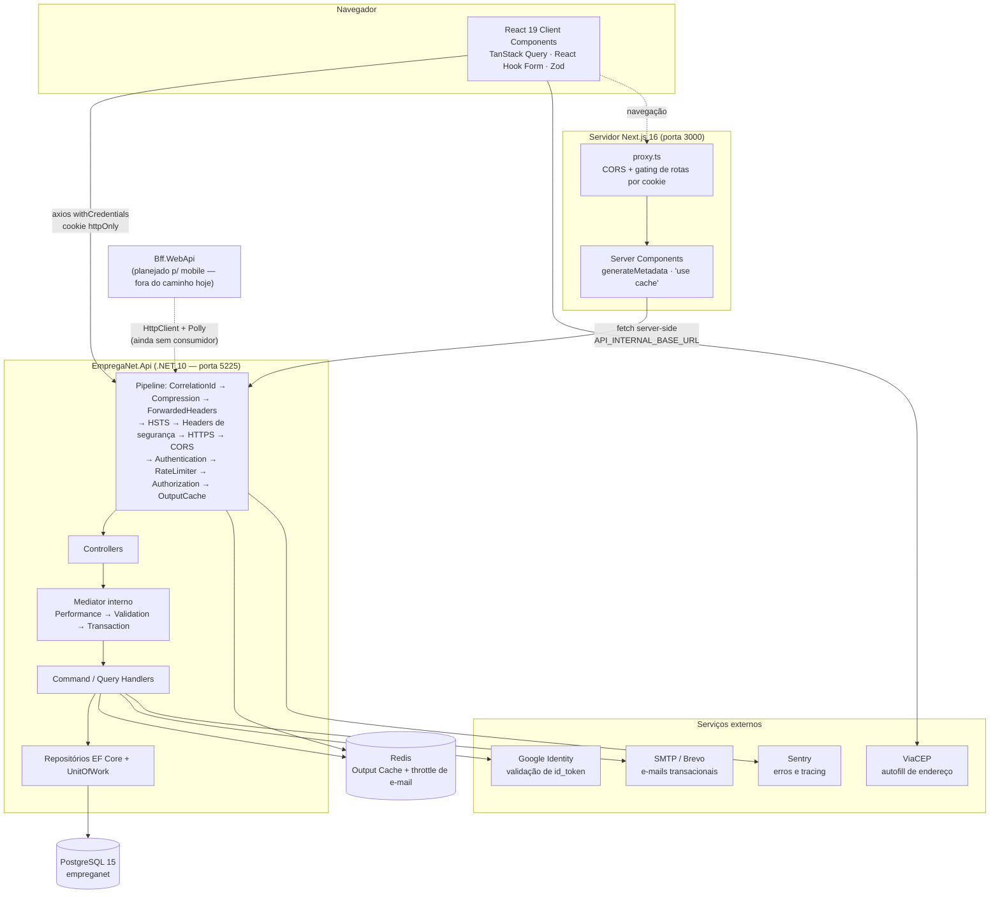
```mermaid
flowchart TB
  subgraph browser["Navegador"]
    UI["React 19 Client Components<br/>TanStack Query · React Hook Form · Zod"]
  end

  subgraph next["Servidor Next.js 16 (porta 3000)"]
    PROXY["proxy.ts<br/>CORS + gating de rotas por cookie"]
    RSC["Server Components<br/>generateMetadata · 'use cache'"]
  end

  subgraph api["EmpregaNet.Api (.NET 10 — porta 5225)"]
    MW["Pipeline: CorrelationId → Compression → ForwardedHeaders<br/>→ HSTS → Headers de segurança → HTTPS → CORS<br/>→ Authentication → RateLimiter → Authorization → OutputCache"]
    CTRL["Controllers"]
    MED["Mediator interno<br/>Performance → Validation → Transaction"]
    HANDLERS["Command / Query Handlers"]
    REPO["Repositórios EF Core + UnitOfWork"]
  end

  DB[("PostgreSQL 15<br/>empreganet")]
  REDIS[("Redis<br/>Output Cache + throttle de e-mail")]

  subgraph ext["Serviços externos"]
    GOOGLE["Google Identity<br/>validação de id_token"]
    SMTP["SMTP / Brevo<br/>e-mails transacionais"]
    SENTRY["Sentry<br/>erros e tracing"]
    VIACEP["ViaCEP<br/>autofill de endereço"]
  end

  BFF["Bff.WebApi<br/>(planejado p/ mobile — fora do caminho hoje)"]

  UI -->|"axios withCredentials<br/>cookie httpOnly"| MW
  UI --> VIACEP
  UI -.->|"navegação"| PROXY
  PROXY --> RSC
  RSC -->|"fetch server-side<br/>API_INTERNAL_BASE_URL"| MW
  MW --> CTRL --> MED --> HANDLERS --> REPO --> DB
  MW --> REDIS
  HANDLERS --> REDIS
  HANDLERS --> GOOGLE
  HANDLERS --> SMTP
  MW --> SENTRY
  BFF -.->|"HttpClient + Polly<br/>(ainda sem consumidor)"| MW
```

### 4.2 Como cada componente se comunica

| Origem | Destino | Protocolo / mecanismo | Autenticação |
| ------ | ------- | --------------------- | ------------ |
| Client Component | API .NET | HTTPS/JSON via axios, `withCredentials: true` | Cookie `access_token` (httpOnly) |
| Server Component | API .NET | `fetch` nativo com `'use cache'` | Nenhuma só endpoints públicos |
| `proxy.ts` (edge) | — | Lê o header `Cookie` da própria requisição | Decodifica o JWT para gating de rota |
| API | PostgreSQL | Npgsql / EF Core 10 | Connection string |
| API | Redis | StackExchange.Redis (`AbortOnConnectFail = false`) | Connection string |
| API | Google | `Google.Apis.Auth` - `ValidateAsync` do `id_token` | `GoogleAuth:ClientIds` |
| API | SMTP | MailKit, StartTls | `Smtp:UserName` / `Smtp:Password` |
| Client Component | ViaCEP | `fetch` público | Nenhuma |

---

## 5. Estrutura de pastas

### Raiz do monorepo

```
EmpregaNetAPI/
├─ .github/workflows/      # CI/CD: build+testes, push ECR, deploy EC2 via SSM
├─ backend/                # API .NET 10 (solução principal)
├─ Bff/                    # Backend-for-Frontend .NET (esqueleto)
├─ docs/                   # SDD, ADRs, perfis de agentes de IA, skills
└─ frontend/               # Next.js 16 (App Router)
```

### `backend/`

| Caminho | Responsabilidade |
| ------- | ---------------- |
| `EmpregaNet.sln` | Solução com os 5 projetos + testes |
| `Dockerfile` | Imagem multi-stage (SDK 10 → aspnet:10.0-alpine), TZ `America/Sao_Paulo` |
| `docker-compose.yml` | Postgres, Redis, RedisInsight, API e BFF |
| `src/EmpregaNet.Domain/` | Núcleo sem dependência de aplicação |
| `src/EmpregaNet.Domain/Entities/` | `User`, `Role`, `Company`, `Job`, `JobApplication`, `Address`, `UserRefreshToken` |
| `src/EmpregaNet.Domain/Enums/` | `UserTypeEnum`, `JobTypeEnum`, `ApplicationStatusEnum`, `DomainErrorEnum`, `UF`, permissões |
| `src/EmpregaNet.Domain/Interfaces/` | `IBaseRepository<T>`, repositórios por agregado, `IUnitOfWork`, `ITransactional`, `IAggregateRoot` |
| `src/EmpregaNet.Domain/Libs/Mediator/` | **Mediator próprio** — `IRequest`, `IRequestHandler`, `IPipelineBehavior`, `INotification` |
| `src/EmpregaNet.Application/` | Casos de uso (um arquivo por handler), ViewModels + mappers, validators FluentValidation |
| `src/EmpregaNet.Application/Auth/` | `JwtBuilder`, `PermissionClaims`, `RecruitmentRoleNames`, `HttpCurrentUser`, options de SMTP/Google/URLs |
| `src/EmpregaNet.Application/Common/Base/` | `GetAllQuery<T>`, `GetByIdQuery<T>`, `CreateCommand<T>`, `UpdateCommand<T,V>`, `DeleteCommand<T>`, `BaseViewModel` |
| `src/EmpregaNet.Application/Common/Exceptions/` | Exceções de aplicação mapeadas para HTTP pelo handler global |
| `src/EmpregaNet.Application/Utils/` | Helpers de formatação e atributos de validação brasileiros (CPF/CNPJ, CEP, telefone) |
| `src/EmpregaNet.Infra/Persistence/` | `PostgreSqlContext`, configurações Fluent API, repositórios, migrations, seeds |
| `src/EmpregaNet.Infra/Behaviors/` | `PerformanceBehaviour`, `ValidationBehavior`, `TransactionBehavior` |
| `src/EmpregaNet.Infra/Cache/` | `RedisServiceCollection`, `OutputCacheManager` |
| `src/EmpregaNet.Infra/Email/` | `SmtpEmailSender`, `AccountEmailService`, templates HTML, throttle (Redis + memória) |
| `src/EmpregaNet.Infra/Extensions/` | Identity/JWT, rate limiter, Sentry, paginação, CloudWatch |
| `src/EmpregaNet.Api/Configuration/` | CORS, Swagger, Output Cache, `AuthCookieService`, ForwardedHeaders, health checks |
| `src/EmpregaNet.Api/Controllers/` | Um diretório por área; `Core/MainController` é a base CRUD genérica |
| `src/EmpregaNet.Api/Middleware/` | `CorrelationIdMiddleware`, `GlobalExceptionHandler` |
| `src/EmpregaNet.AI/` | `OpenAiClientProvider` + options; `Agents/`, `Prompts/`, `Skills/` vazios |
| `tests/` | xUnit — `Unit/`, `Integration/`, `Support/` (fixtures compartilhadas) |

### `frontend/src/`

| Caminho | Responsabilidade |
| ------- | ---------------- |
| `app/` | Rotas do App Router - **apenas composição**, sem lógica de negócio |
| `app/(auth)/` | Login, registro, confirmação de e-mail, recuperação de senha |
| `app/(main)/` | Área autenticada: dashboard, conta, candidaturas, recrutamento, admin |
| `app/(public)/` | Catálogo de vagas sem guard (SSR + SEO) |
| `app/(status)/` | Páginas de estado, como `/nao-autorizado` |
| `app/layout.tsx` · `error.tsx` · `global-error.tsx` · `not-found.tsx` | Shell raiz e error boundaries do framework |
| `features/<feature>/` | **Feature-based**: UI, formulários e o `service/` daquela feature |
| `features/<feature>/service/` | `*-api.ts` (chamadas), `*-schema.ts` (Zod), `*-queries.ts` (hooks), `*-keys.ts` (query keys) |
| `proxy.ts` | Middleware de borda: CORS e gating de rota lendo o cookie httpOnly |
| `shared/api/` | Instância axios singleton, interceptor de refresh, cliente ViaCEP |
| `shared/auth/` | Sessão: leitura server-side do cookie, decodificação do JWT, metadados no `localStorage` |
| `shared/components/ui/` | Design system em **Atomic Design** (`atoms/`, `molecules/`, `organisms/`) |
| `shared/components/form-fields/` | Campos integrados ao React Hook Form (input, select, autocomplete, phone, textarea) |
| `shared/components/common/` | Loading, error boundaries, branding, páginas standalone |
| `shared/components/providers/` | `AppProviders` (Query → Auth → Theme → Tooltip → Toaster) |
| `shared/context/` | `auth-context` (sessão) e `form-context` (RHF + Zod) |
| `shared/hooks/` | Hooks transversais: debounce, permissões, paginação persistida, autofill de CEP |
| `shared/schema/` | Schemas Zod compartilhados: paginação, `DomainError`, parâmetros de listagem |
| `shared/shell/` | AppShell, sidebar, header, `route-access-guard`, navegação por role |
| `shared/utils/lib/` | `rbac`, `route-access-policy`, `env` (Zod), `query-client`, `user-types`, `toast` |
| `shared/utils/errors/` | Parsing do `DomainError` da API e feedback uniforme de mutations |
| `tests/` | Cucumber/Gherkin — `specs/` (features), `steps/`, `support/` |

---

## 6. Tecnologias utilizadas

### Backend

| Tecnologia | Versão | Para que serve |
| ---------- | ------ | -------------- |
| .NET / ASP.NET Core | 10.0 | Runtime e framework web |
| EF Core + Npgsql | 10.0.8 / 10.0.2 | ORM e provider PostgreSQL |
| ASP.NET Core Identity | 10.0.8 | Usuários, roles, hash de senha, lockout, tokens de e-mail |
| `Microsoft.AspNetCore.Authentication.JwtBearer` | 10.0.8 | Validação do JWT (com leitura a partir do cookie) |
| FluentValidation | 12.1.1 | Validação de commands/queries no pipeline |
| StackExchange.Redis | 2.10.1 | Output Cache distribuído e contador de throttle de e-mail |
| `Microsoft.AspNetCore.OutputCaching.StackExchangeRedis` | 10.0.8 | Backing store do Output Cache |
| MailKit / MimeKit | 4.17.0 | Envio SMTP com StartTls |
| Google.Apis.Auth | 1.75.0 | Validação do `id_token` do Google Sign-In |
| Sentry.AspNetCore | 6.6.0 | Captura de erros e tracing |
| Swashbuckle | 10.2.1 | Geração do OpenAPI e Swagger UI |
| Newtonsoft.Json (MVC) | 13.0.4 | Serialização com `ReferenceLoopHandling.Ignore` |
| `System.Threading.RateLimiting` | (BCL) | Token bucket do rate limiter customizado |
| AWS.Logger.AspNetCore | 4.0.2 | CloudWatch (registrado, **comentado** hoje) |
| OpenAI | 2.2.0 | Cliente para os agentes ainda não implementados |
| xUnit · FluentAssertions · Moq · EFCore.InMemory | — | Testes unitários e de integração |

### Frontend

| Tecnologia | Versão | Para que serve |
| ---------- | ------ | -------------- |
| Next.js | 16.2.6 | App Router, SSR, `cacheComponents`, Turbopack |
| React / React DOM | 19.2.6 | Biblioteca de UI |
| TypeScript | 6.0.3 | Tipagem estática em modo `strict` |
| TanStack Query | 5.100 | Cache de dados do servidor, mutations, invalidação |
| axios | 1.16 | Cliente HTTP com interceptor de refresh de sessão |
| Zod | 4.4 | Validação de formulários **e** de fronteira das respostas da API |
| React Hook Form + `@hookform/resolvers` | 7.75 / 5.2 | Formulários controlados com resolver Zod |
| Radix UI | — | Primitivas acessíveis (dialog, select, popover, tooltip, label, slot) |
| `class-variance-authority` · `clsx` | — | Variantes de componente e composição de classes |
| Sass (SCSS modules) | 1.99 | Estilos — **não há Tailwind neste projeto** |
| `lucide-react` | 1.14 | Ícones |
| `next-themes` | 0.4 | Tema claro/escuro |
| `sonner` | 2.0 | Toasts |
| `jwt-decode` | 4.0 | Leitura de claims (roles, exp) no gating de rotas |
| `qs` | 6.15 | Serialização de query string (`arrayFormat: 'repeat'`) |
| `cmdk` | 1.1 | Command palette / autocomplete |
| `server-only` | 0.0.1 | Guard de build para módulos exclusivamente server-side |
| Cucumber.js + `tsx` + chai | 12.9 | BDD em Gherkin, sem etapa de transpilação |
| ESLint 10 + Prettier 3 | — | Lint e formatação |

### Infraestrutura

| Tecnologia | Para que serve |
| ---------- | -------------- |
| PostgreSQL 15 (alpine) | Banco relacional |
| Redis (alpine) | Cache distribuído; **opcional** - sem ele o Output Cache cai para memória local |
| RedisInsight | Inspeção do Redis em desenvolvimento |
| Docker + Docker Compose | Stack local completa |
| GitHub Actions | CI (build + testes) e CD (ECR → EC2 via SSM) |
| AWS ECR · EC2 · SSM · ALB | Registro de imagem, execução e deploy (topologia planejada no ADR 0004) |

---

## 7. Padrões arquiteturais adotados

| Padrão | Onde está | Como é aplicado |
| ------ | --------- | --------------- |
| **Clean Architecture** | `backend/src/` | Dependências apontam para dentro; `Domain` não conhece `Api`; `Application` define abstrações (`IJwtBuilder`, `IOutputCacheManager`, `IEmailThrottleService`) implementadas em `Infra` |
| **CQRS** | `Application/*/Commands` e `Application/*/Queries` | Commands mutam e são transacionais (`ITransactional`); queries só leem e podem ser cacheadas |
| **Mediator (implementação própria)** | `Domain/Libs/Mediator` | `IMediator.Send` resolve `IRequestHandler<TRequest,TResponse>` via DI, com wrapper cacheado por tipo (sem reflexão no caminho quente). **Não use MediatR** |
| **Pipeline / Decorator** | `Infra/Behaviors` | Ordem de registro = ordem de execução: `Performance` → `Validation` → `Transaction` |
| **Repository + Unit of Work** | `Infra/Persistence/Repositories` | `IBaseRepository<T>` genérico + repositórios especializados; `UnityOfWork.ExecuteInTransactionAsync` |
| **DDD (tático, parcial)** | `Domain/Entities` | `IAggregateRoot`, invariantes na entidade (`Job.Close()`, `JobApplication.ChangeStatus`), setters privados em `Job`/`JobApplication` |
| **Value Object** | `Address` | Persistido como owned type, sem tabela própria (mas ainda marcado como `IAggregateRoot`)|
| **Soft delete** | `PostgreSqlContext.SaveChangesAsync` | `EntityState.Deleted` é convertido em `Modified` com `IsDeleted`/`DeletedAt` |
| **Template Method** | `MainController<TCreate,TUpdate,TView>` | CRUD genérico com `virtual`; controllers concretos sobrescrevem para adicionar policies e filtros |
| **Options Pattern** | `*Options.cs` | `JwtSettings`, `RedisOptions`, `RateLimit`, `SmtpEmailOptions`, `AppUrlsOptions`, `OutputCacheOptions`, `SeedOptions`, `OpenAiOptions` |
| **MVC (API)** | `Api/Controllers` | Controllers clássicos com atributos, não Minimal APIs |
| **Feature-based (frontend)** | `frontend/src/features` | Cada feature possui UI, schemas e serviço próprios; `shared/` só para o que é realmente transversal |
| **Atomic Design** | `shared/components/ui` | `atoms/` → `molecules/` → `organisms/` |
| **Barrel exports + path aliases** | `index.ts` por pasta, `tsconfig.paths` | `@/components`, `@/context`, `@/hooks`, `@/utils`, `@/shared` |
| **Spec-Driven Development** | `docs/sdd/` | PRD → design → spec/tasks antes do código, com gates de verificação |
| **ADR** | `docs/sdd/adrs/` | Decisões estruturais com contexto, decisão, consequências e revisões datadas |

---

## 8. Modelo de dados

Tabelas do ASP.NET Core Identity (`AspNetUsers`, `AspNetRoles`, `AspNetUserRoles`, `AspNetRoleClaims`,
`AspNetUserClaims`, `AspNetUserLogins`, `AspNetUserTokens`) mais quatro agregados do domínio.
`User` e `Role` usam chave `long`; `Address` é *owned type* embutido em `User` e `Company`.

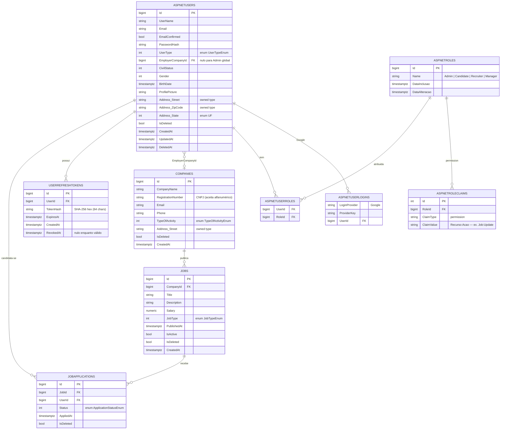
```mermaid
erDiagram
  ASPNETUSERS ||--o{ JOBAPPLICATIONS : "candidata-se"
  ASPNETUSERS ||--o{ USERREFRESHTOKENS : "possui"
  ASPNETUSERS }o--o| COMPANIES : "EmployerCompanyId"
  ASPNETUSERS ||--o{ ASPNETUSERROLES : "tem"
  ASPNETROLES ||--o{ ASPNETUSERROLES : "atribuida"
  ASPNETROLES ||--o{ ASPNETROLECLAIMS : "permission"
  ASPNETUSERS ||--o{ ASPNETUSERLOGINS : "Google"
  COMPANIES ||--o{ JOBS : "publica"
  JOBS ||--o{ JOBAPPLICATIONS : "recebe"

  ASPNETUSERS {
    bigint Id PK
    string UserName
    string Email
    bool EmailConfirmed
    string PasswordHash
    int UserType "enum UserTypeEnum"
    bigint EmployerCompanyId FK "nulo para Admin global"
    int CivilStatus
    int Gender
    timestamptz BirthDate
    string ProfilePicture
    string Address_Street "owned type"
    string Address_ZipCode "owned type"
    int Address_State "enum UF"
    bool IsDeleted
    timestamptz CreatedAt
    timestamptz UpdatedAt
    timestamptz DeletedAt
  }

  ASPNETROLES {
    bigint Id PK
    string Name "Admin | Candidate | Recruiter | Manager"
    timestamptz DataInclusao
    timestamptz DataAlteracao
  }

  ASPNETROLECLAIMS {
    int Id PK
    bigint RoleId FK
    string ClaimType "permission"
    string ClaimValue "Recurso:Acao — ex. Job:Update"
  }

  ASPNETUSERROLES {
    bigint UserId FK
    bigint RoleId FK
  }

  ASPNETUSERLOGINS {
    string LoginProvider "Google"
    string ProviderKey
    bigint UserId FK
  }

  COMPANIES {
    bigint Id PK
    string CompanyName
    string RegistrationNumber "CNPJ (aceita alfanumérico)"
    string Email
    string Phone
    int TypeOfActivity "enum TypeOfActivityEnum"
    string Address_Street "owned type"
    bool IsDeleted
    timestamptz CreatedAt
  }

  JOBS {
    bigint Id PK
    bigint CompanyId FK
    string Title
    string Description
    numeric Salary
    int JobType "enum JobTypeEnum"
    timestamptz PublishedAt
    bool IsActive
    bool IsDeleted
    timestamptz CreatedAt
  }

  JOBAPPLICATIONS {
    bigint Id PK
    bigint JobId FK
    bigint UserId FK
    int Status "enum ApplicationStatusEnum"
    timestamptz AppliedAt
    bool IsDeleted
  }

  USERREFRESHTOKENS {
    bigint Id PK
    bigint UserId FK
    string TokenHash "SHA-256 hex (64 chars)"
    timestamptz ExpiresAt
    timestamptz CreatedAt
    timestamptz RevokedAt "nulo enquanto válido"
  }
```

### Ciclo de vida da candidatura

`ApplicationStatusEnum` tem nove membros, mas as transições reais dependem de quem chama o endpoint
`PUT /api/jobapplications/{id}`. A entidade impõe duas invariantes: não é possível voltar para
`NaoSelecionado` e não é possível “transicionar” para o status atual.

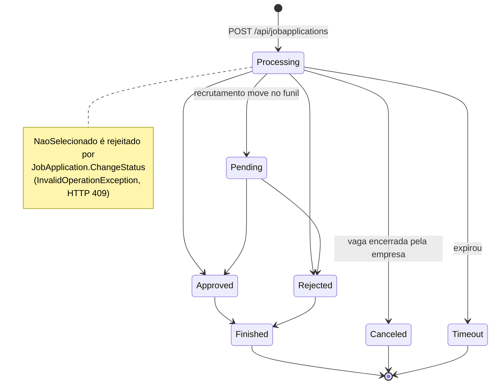
```mermaid
stateDiagram-v2
  [*] --> Processing : POST /api/jobapplications
  Processing --> Pending : recrutamento move no funil
  Processing --> Approved
  Processing --> Rejected
  Pending --> Approved
  Pending --> Rejected
  Approved --> Finished
  Rejected --> Finished
  Processing --> Canceled : vaga encerrada pela empresa
  Processing --> Timeout : expirou
  Finished --> [*]
  Canceled --> [*]
  Timeout --> [*]

  note right of Processing
    NaoSelecionado é rejeitado por
    JobApplication.ChangeStatus
    (InvalidOperationException, HTTP 409)
  end note
```

---

## 9. Autenticação e autorização

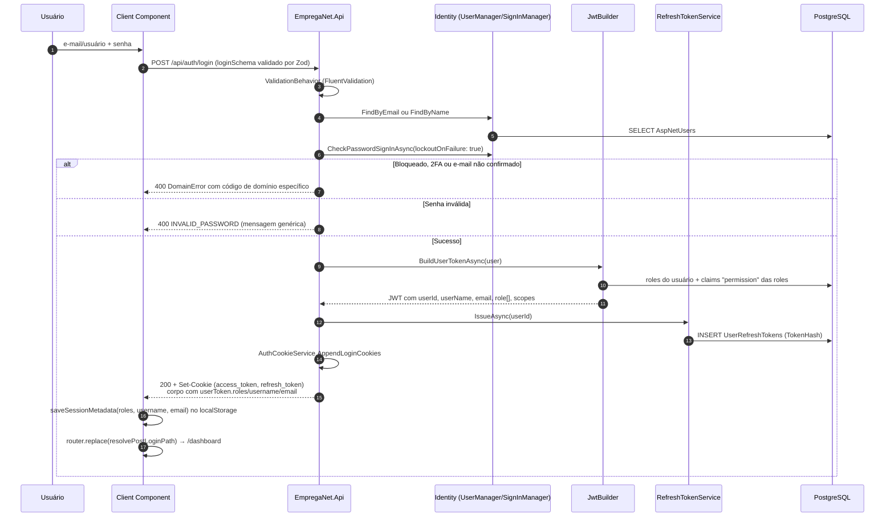
```mermaid
sequenceDiagram
  autonumber
  participant U as Usuário
  participant FE as Client Component
  participant API as EmpregaNet.Api
  participant ID as Identity (UserManager/SignInManager)
  participant JWT as JwtBuilder
  participant RT as RefreshTokenService
  participant DB as PostgreSQL

  U->>FE: e-mail/usuário + senha
  FE->>API: POST /api/auth/login (loginSchema validado por Zod)
  API->>API: ValidationBehavior (FluentValidation)
  API->>ID: FindByEmail ou FindByName
  ID->>DB: SELECT AspNetUsers
  API->>ID: CheckPasswordSignInAsync(lockoutOnFailure: true)

  alt Bloqueado, 2FA ou e-mail não confirmado
    API-->>FE: 400 DomainError com código de domínio específico
  else Senha inválida
    API-->>FE: 400 INVALID_PASSWORD (mensagem genérica)
  else Sucesso
    API->>JWT: BuildUserTokenAsync(user)
    JWT->>DB: roles do usuário + claims "permission" das roles
    JWT-->>API: JWT com userId, userName, email, role[], scopes
    API->>RT: IssueAsync(userId)
    RT->>DB: INSERT UserRefreshTokens (TokenHash)
    API->>API: AuthCookieService.AppendLoginCookies
    API-->>FE: 200 + Set-Cookie (access_token, refresh_token)<br/>corpo com userToken.roles/username/email
    FE->>FE: saveSessionMetadata(roles, username, email) no localStorage
    FE->>FE: router.replace(resolvePostLoginPath) → /dashboard
  end
```

### 9.1 Renovação de sessão (rotação + detecção de reuso)

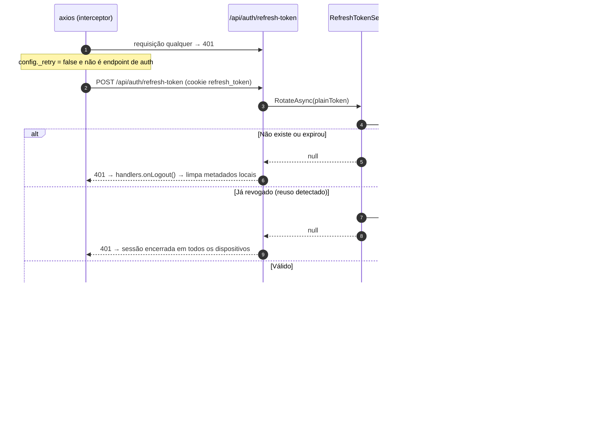
```mermaid
sequenceDiagram
  autonumber
  participant FE as axios (interceptor)
  participant API as /api/auth/refresh-token
  participant RT as RefreshTokenService
  participant DB as PostgreSQL

  FE->>API: requisição qualquer → 401
  Note over FE: config._retry = false e não é endpoint de auth
  FE->>API: POST /api/auth/refresh-token (cookie refresh_token)
  API->>RT: RotateAsync(plainToken)
  RT->>DB: SELECT por SHA-256 do token

  alt Não existe ou expirou
    RT-->>API: null
    API-->>FE: 401 → handlers.onLogout() → limpa metadados locais
  else Já revogado (reuso detectado)
    RT->>DB: RevokeAllForUserAsync(userId)
    RT-->>API: null
    API-->>FE: 401 → sessão encerrada em todos os dispositivos
  else Válido
    RT->>DB: UPDATE RevokedAt no antigo + INSERT novo hash
    API->>API: AppendLoginCookies (novos access + refresh)
    API-->>FE: 200 + Set-Cookie
    FE->>FE: onSessionRefreshed → atualiza metadados
    FE->>API: repete a requisição original (cookie já renovado)
  end
```

### 9.2 Autorização no frontend - três camadas, uma política

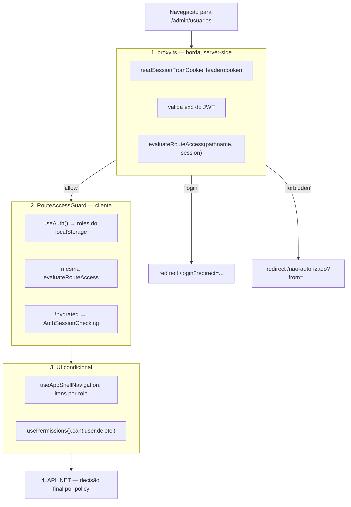
```mermaid
flowchart TB
  REQ["Navegação para /admin/usuarios"] --> PROXY

  subgraph PROXY["1. proxy.ts — borda, server-side"]
    P1["readSessionFromCookieHeader(cookie)"]
    P2["valida exp do JWT"]
    P3["evaluateRouteAccess(pathname, session)"]
  end

  PROXY -->|"'login'"| L["redirect /login?redirect=..."]
  PROXY -->|"'forbidden'"| F["redirect /nao-autorizado?from=..."]
  PROXY -->|"'allow'"| GUARD

  subgraph GUARD["2. RouteAccessGuard — cliente"]
    G1["useAuth() → roles do localStorage"]
    G2["mesma evaluateRouteAccess"]
    G3["!hydrated → AuthSessionChecking"]
  end

  GUARD --> UI

  subgraph UI["3. UI condicional"]
    U1["useAppShellNavigation: itens por role"]
    U2["usePermissions().can('user.delete')"]
  end

  UI --> API["4. API .NET — decisão final por policy"]
```

## 10. Fluxo de navegação

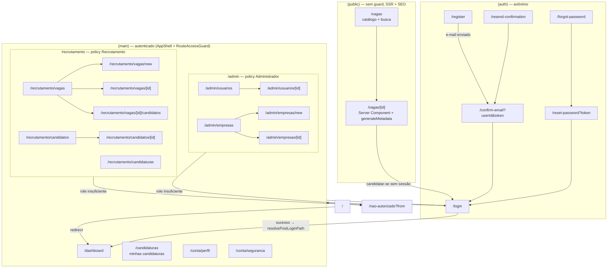
```mermaid
flowchart TD
  ROOT["/"] -->|redirect| DASH["/dashboard"]

  subgraph PUB["(public) — sem guard, SSR + SEO"]
    VAGAS["/vagas<br/>catálogo + busca"]
    VAGA["/vagas/[id]<br/>Server Component + generateMetadata"]
  end

  subgraph AUTHSEG["(auth) — anônimo"]
    LOGIN["/login"]
    REG["/register"]
    FORGOT["/forgot-password"]
    RESET["/reset-password?token"]
    CONFIRM["/confirm-email?userId&token"]
    RESEND["/resend-confirmation"]
  end

  subgraph MAIN["(main) — autenticado (AppShell + RouteAccessGuard)"]
    DASH
    CAND["/candidaturas<br/>minhas candidaturas"]
    PERFIL["/conta/perfil"]
    SEG["/conta/seguranca"]

    subgraph RECR["/recrutamento — policy Recrutamento"]
      RVAGAS["/recrutamento/vagas"]
      RVAGANEW["/recrutamento/vagas/new"]
      RVAGAEDIT["/recrutamento/vagas/[id]"]
      RVAGACAND["/recrutamento/vagas/[id]/candidatos"]
      RCANDS["/recrutamento/candidatos"]
      RCAND["/recrutamento/candidatos/[id]"]
      RAPPS["/recrutamento/candidaturas"]
    end

    subgraph ADM["/admin — policy Administrador"]
      AUSERS["/admin/usuarios"]
      AUSER["/admin/usuarios/[id]"]
      AEMP["/admin/empresas"]
      AEMPNEW["/admin/empresas/new"]
      AEMPEDIT["/admin/empresas/[id]"]
    end
  end

  NAOAUT["/nao-autorizado?from"]

  VAGAS --> VAGA
  VAGA -->|"candidatar-se sem sessão"| LOGIN
  LOGIN -->|"sucesso → resolvePostLoginPath"| DASH
  LOGIN -->|"?redirect=/rota"| MAIN
  REG -->|"e-mail enviado"| CONFIRM
  CONFIRM --> LOGIN
  FORGOT --> RESET --> LOGIN
  RESEND --> CONFIRM
  MAIN -->|"sessão ausente/expirada"| LOGIN
  RECR -->|"role insuficiente"| NAOAUT
  ADM -->|"role insuficiente"| NAOAUT
  RVAGAS --> RVAGANEW
  RVAGAS --> RVAGAEDIT
  RVAGAS --> RVAGACAND
  RCANDS --> RCAND
  AUSERS --> AUSER
  AEMP --> AEMPNEW
  AEMP --> AEMPEDIT
```
---

## 11. Fluxo de requisições HTTP

### 11.1 Mutação autenticada (do clique ao commit)

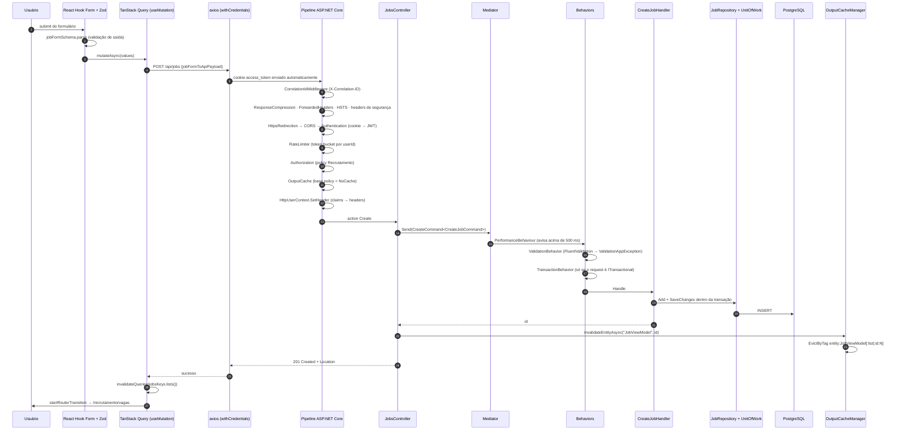
```mermaid
sequenceDiagram
  autonumber
  participant U as Usuário
  participant F as React Hook Form + Zod
  participant Q as TanStack Query (useMutation)
  participant AX as axios (withCredentials)
  participant P as Pipeline ASP.NET Core
  participant C as JobsController
  participant M as Mediator
  participant B as Behaviors
  participant H as CreateJobHandler
  participant R as JobRepository + UnitOfWork
  participant DB as PostgreSQL
  participant OC as OutputCacheManager

  U->>F: submit do formulário
  F->>F: jobFormSchema.parse (validação de saída)
  F->>Q: mutateAsync(values)
  Q->>AX: POST /api/jobs (jobFormToApiPayload)
  AX->>P: cookie access_token enviado automaticamente

  P->>P: CorrelationIdMiddleware (X-Correlation-ID)
  P->>P: ResponseCompression · ForwardedHeaders · HSTS · headers de segurança
  P->>P: HttpsRedirection → CORS → Authentication (cookie → JWT)
  P->>P: RateLimiter (token bucket por userId)
  P->>P: Authorization (policy Recrutamento)
  P->>P: OutputCache (base policy = NoCache)
  P->>P: HttpUserContext.SetHeader (claims → headers)
  P->>C: action Create
  C->>M: Send(CreateCommand<CreateJobCommand>)
  M->>B: PerformanceBehaviour (avisa acima de 500 ms)
  B->>B: ValidationBehavior (FluentValidation → ValidationAppException)
  B->>B: TransactionBehavior (só se o request é ITransactional)
  B->>H: Handle
  H->>R: Add + SaveChanges dentro da transação
  R->>DB: INSERT
  H-->>C: id
  C->>OC: InvalidateEntityAsync("JobViewModel", id)
  OC->>OC: EvictByTag entity:JobViewModel[:list|:id:N]
  C-->>AX: 201 Created + Location
  AX-->>Q: sucesso
  Q->>Q: invalidateQueries(jobsKeys.lists())
  Q->>U: startRouterTransition → /recrutamento/vagas
```

### 11.2 Leitura pública com SSR (catálogo de vagas)

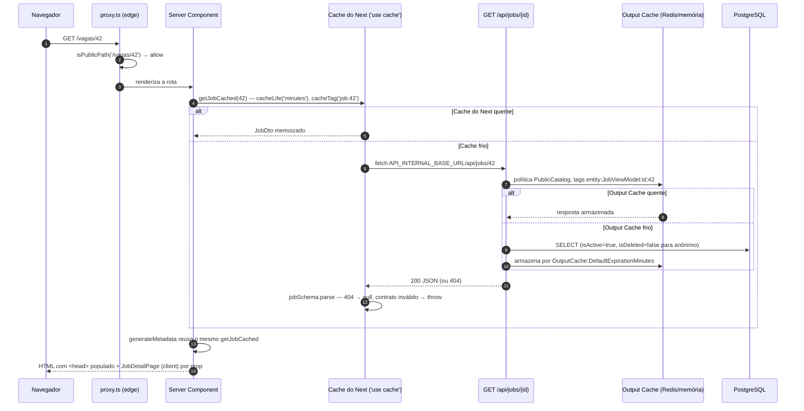
```mermaid
sequenceDiagram
  autonumber
  participant U as Navegador
  participant PX as proxy.ts (edge)
  participant RSC as Server Component
  participant CACHE as Cache do Next ('use cache')
  participant API as GET /api/jobs/{id}
  participant OC as Output Cache (Redis/memória)
  participant DB as PostgreSQL

  U->>PX: GET /vagas/42
  PX->>PX: isPublicPath('/vagas/42') → allow
  PX->>RSC: renderiza a rota
  RSC->>CACHE: getJobCached(42) — cacheLife('minutes'), cacheTag('job:42')

  alt Cache do Next quente
    CACHE-->>RSC: JobDto memoizado
  else Cache frio
    CACHE->>API: fetch API_INTERNAL_BASE_URL/api/jobs/42
    API->>OC: política PublicCatalog, tags entity:JobViewModel:id:42

    alt Output Cache quente
      OC-->>API: resposta armazenada
    else Output Cache frio
      API->>DB: SELECT (isActive=true, isDeleted=false para anônimo)
      API->>OC: armazena por OutputCache:DefaultExpirationMinutes
    end

    API-->>CACHE: 200 JSON (ou 404)
    CACHE->>CACHE: jobSchema.parse — 404 → null, contrato inválido → throw
  end

  RSC->>RSC: generateMetadata reusa o mesmo getJobCached
  RSC-->>U: HTML com <head> populado + JobDetailPage (client) por prop
```

---

## 12. Gerenciamento de estado

### Árvore de providers

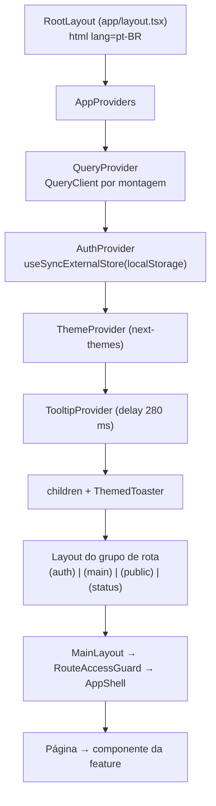
```mermaid
flowchart TB
  A["RootLayout (app/layout.tsx)<br/>html lang=pt-BR"] --> B["AppProviders"]
  B --> C["QueryProvider<br/>QueryClient por montagem"]
  C --> D["AuthProvider<br/>useSyncExternalStore(localStorage)"]
  D --> E["ThemeProvider (next-themes)"]
  E --> F["TooltipProvider (delay 280 ms)"]
  F --> G["children + ThemedToaster"]
  G --> H["Layout do grupo de rota<br/>(auth) | (main) | (public) | (status)"]
  H --> I["MainLayout → RouteAccessGuard → AppShell"]
  I --> J["Página → componente da feature"]
```
---

## 13. Estratégia de cache

Existem **quatro camadas** de cache. Saber qual delas está servindo um dado desatualizado economiza
muito tempo de depuração.

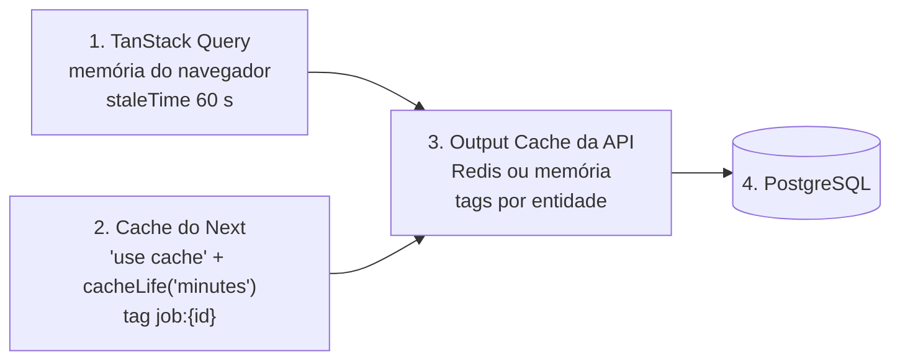
```mermaid
flowchart LR
  BROWSER["1. TanStack Query<br/>memória do navegador<br/>staleTime 60 s"]
  NEXTC["2. Cache do Next<br/>'use cache' + cacheLife('minutes')<br/>tag job:{id}"]
  OUTPUT["3. Output Cache da API<br/>Redis ou memória<br/>tags por entidade"]
  DB[("4. PostgreSQL")]

  BROWSER --> OUTPUT
  NEXTC --> OUTPUT
  OUTPUT --> DB
```

## 14. Tratamento de erros e exceções

### 14.1 Contrato único de erro — `DomainError`

Todas as respostas de erro da API têm a mesma forma (serializada em **camelCase**):

```json
{
  "statusCode": 400,
  "code": "INVALID_PARAMS",
  "message": "Requisição inválida.",
  "details": {
    "Errors": ["O título é obrigatório.", "Informe um salário válido."],
    "StackTrace": "... apenas em Development ..."
  },
  "correlationId": "b7c1e2f4-..."
}
```

### 14.2 Tratamento no frontend

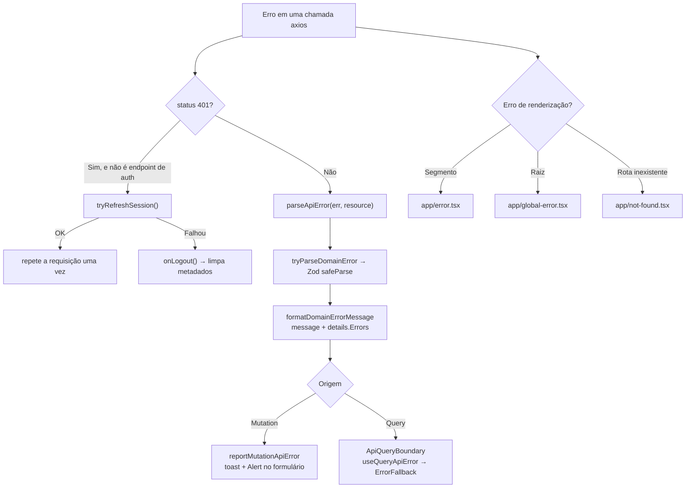
```mermaid
flowchart TB
  ERR["Erro em uma chamada axios"] --> IS401{"status 401?"}
  IS401 -->|Sim, e não é endpoint de auth| REFRESH["tryRefreshSession()"]
  REFRESH -->|OK| RETRY["repete a requisição uma vez"]
  REFRESH -->|Falhou| LOGOUT["onLogout() → limpa metadados"]
  IS401 -->|Não| PARSE["parseApiError(err, resource)"]
  PARSE --> DOM["tryParseDomainError → Zod safeParse"]
  DOM --> MSG["formatDomainErrorMessage<br/>message + details.Errors"]
  MSG --> MUT{"Origem"}
  MUT -->|Mutation| REPORT["reportMutationApiError<br/>toast + Alert no formulário"]
  MUT -->|Query| BOUND["ApiQueryBoundary<br/>useQueryApiError → ErrorFallback"]
  ERR --> RENDER{"Erro de renderização?"}
  RENDER -->|Segmento| SEGERR["app/error.tsx"]
  RENDER -->|Raiz| GLOBERR["app/global-error.tsx"]
  RENDER -->|Rota inexistente| NF["app/not-found.tsx"]
```

---

## 15. Configurando o ambiente de desenvolvimento

### Pré-requisitos

| Ferramenta | Versão | Necessário para |
| ---------- | ------ | --------------- |
| [.NET SDK](https://dotnet.microsoft.com/download/dotnet/10.0) | 10.x | API e BFF |
| [Node.js](https://nodejs.org) | 20+ (recomendado 22) | Frontend |
| [pnpm](https://pnpm.io) | 9.15.9 (fixado em `packageManager`) | Frontend — **não use npm nem yarn** |
| PostgreSQL | 15+ | Banco, se rodar fora do Docker |
| Redis | 7+ | Opcional |
| Docker + Docker Compose | recente | Stack local completa |
| `dotnet-ef` | 10.x | Migrations (`dotnet tool install --global dotnet-ef`) |

### Passo a passo

**1. Clonar e restaurar**

```bash
git clone <url-do-repositorio> && cd EmpregaNetAPI
```

```bash
dotnet restore backend/EmpregaNet.sln
```

```bash
cd frontend && pnpm install
```

**2. Criar os arquivos de configuração - obrigatório**

`backend/src/EmpregaNet.Api/appsettings.Development.json`:

```json
{
  "ConnectionStrings": {
    "PostgreSQLConnection": "Host=localhost;Port=5432;Database=nome_banco;Username=postgres;Password=postgres;"
  },
  "JwtSettings": {
    "SecretKey": "troque-por-um-segredo-com-32-bytes-ou-mais",
    "ExpirationHours": 24,
    "Issuer": "EmpregaNet.Api.Dev",
    "Audience": "EmpregaNet.App.Dev",
    "RefreshTokenExpirationDays": 30
  },
  "AppUrls": {
    "PublicAppBaseUrl": "http://localhost:3000",
    "PasswordResetPath": "/reset-password",
    "EmailConfirmationPath": "/confirm-email",
    "CorsAllowedOrigins": ["http://localhost:3000", "https://localhost:3000"]
  },
  "GoogleAuth": { "ClientIds": [] },
  "Smtp": { "Enabled": false },
  "Seed": {
    "AdminEmail": "",
    "AdminUserName": "",
    "AdminPassword": ""
  },
  "Redis": { "Enabled": false, "ConnectionString": "", "InstanceName": "EmpregaNet:" },
  "OutputCache": { "DefaultExpirationMinutes": 5, "SizeLimitMegabytes": 64 },
  "RateLimiting": { "Enabled": true, "BurstCapacity": 240, "SustainedPerPeriod": 120 },
  "ForwardedHeaders": { "KnownProxies": [], "KnownNetworks": [] },
  "Sentry": { "Dsn": "" }
}
```

Prefira **user-secrets** para os valores sensíveis, em vez de deixá-los no arquivo:

```bash
dotnet user-secrets set "JwtSettings:SecretKey" "seu-segredo-de-32-bytes-ou-mais" --project backend/src/EmpregaNet.Api
```

`frontend/.env`:

```bash
NEXT_PUBLIC_API_BASE_URL=http://localhost:5225
NEXT_PUBLIC_GOOGLE_CLIENT_ID=
# NEXT_PUBLIC_ALLOWED_ORIGINS=http://localhost:3000
# API_INTERNAL_BASE_URL=http://api:8080
```

`backend/.env` (só para o Docker Compose):

```bash
POSTGRES_DB=empreganet
POSTGRES_USER=postgres
POSTGRES_PASSWORD=postgres
POSTGRES_PORT=5432
POSTGRES_HOST=localhost
REDIS_PORT=6379
REDIS_HOST=localhost
REDIS_INSIGHT_PORT=5540
API_PORT=5225
BFF_PORT=5143
```

`Bff/.env`:

```bash
BFF_PORT=5143
```

**3. Subir a infraestrutura**

```bash
docker compose -f backend/docker-compose.yml --env-file backend/.env --env-file Bff/.env up -d postgres redis redisinsight
```

**4. Aplicar as migrations**

Em Development e Staging, `Program.cs` chama `ApplyPendingMigrations()` no boot — normalmente basta
subir a API. Para rodar manualmente:

```bash
dotnet ef database update --project backend/src/EmpregaNet.Infra --startup-project backend/src/EmpregaNet.Api --context PostgreSqlContext
```

---

## 16. Executando o projeto localmente

### Opção A — Docker Compose (infra + API + BFF)

Os dois `--env-file` são necessários: `${BFF_PORT}` é interpolado a partir de `Bff/.env`.

```bash
docker compose -f backend/docker-compose.yml --env-file backend/.env --env-file Bff/.env up --build -d
```

```bash
docker compose -f backend/docker-compose.yml ps
```

```bash
docker compose -f backend/docker-compose.yml logs -f api
```

```bash
docker compose -f backend/docker-compose.yml down
```

### Opção B - apenas a infraestrutura no Docker, aplicações no host (recomendado para desenvolver)

```bash
docker compose -f backend/docker-compose.yml --env-file backend/.env --env-file Bff/.env up -d postgres redis redisinsight
```

API (`http://localhost:5225`, Swagger em `/swagger`):

```bash
dotnet run --project backend/src/EmpregaNet.Api
```

Frontend (`http://localhost:3000`):

```bash
cd frontend && pnpm dev
```

BFF, se precisar (não é usado pelo frontend):

```bash
dotnet run --project Bff/Bff.WebApi
```

### Portas

| Serviço | Porta | Observação |
| ------- | ----- | ---------- |
| Frontend (Next) | 3000 | `pnpm dev` |
| API (HTTP) | 5225 | Perfil `http` do `launchSettings.json` |
| API (HTTPS) | 7249 | Perfil `https` |
| BFF | 5143 | Conforme `.env` |
| PostgreSQL | 5432 | |
| Redis | 6379 | |
| RedisInsight | 5540 | |

### Migrations do EF Core

Criar:

```bash
dotnet ef migrations add NomeDaMigracao --project backend/src/EmpregaNet.Infra --startup-project backend/src/EmpregaNet.Api --context PostgreSqlContext --output-dir Persistence/Migrations
```

Aplicar:

```bash
dotnet ef database update --project backend/src/EmpregaNet.Infra --startup-project backend/src/EmpregaNet.Api --context PostgreSqlContext
```

Reverter para uma migration específica:

```bash
dotnet ef database update NomeDaMigracaoAnterior --project backend/src/EmpregaNet.Infra --startup-project backend/src/EmpregaNet.Api --context PostgreSqlContext
```

> Migrations **devem** ser versionadas — `backend/.gitignore` traz um comentário explícito nesse
> sentido. `Persistence/Migrations` é a pasta canônica.

---

## 17. Build de produção e CI/CD

### Build local

Backend (Release):

```bash
dotnet publish backend/src/EmpregaNet.Api -c Release -o ./publish
```

Imagem Docker da API (a partir da raiz do repositório):

```bash
docker build --platform linux/amd64 -f backend/Dockerfile -t empreganet-api ./backend
```

Frontend:

```bash
cd frontend && pnpm build && pnpm start
```

### Pipeline no GitHub Actions

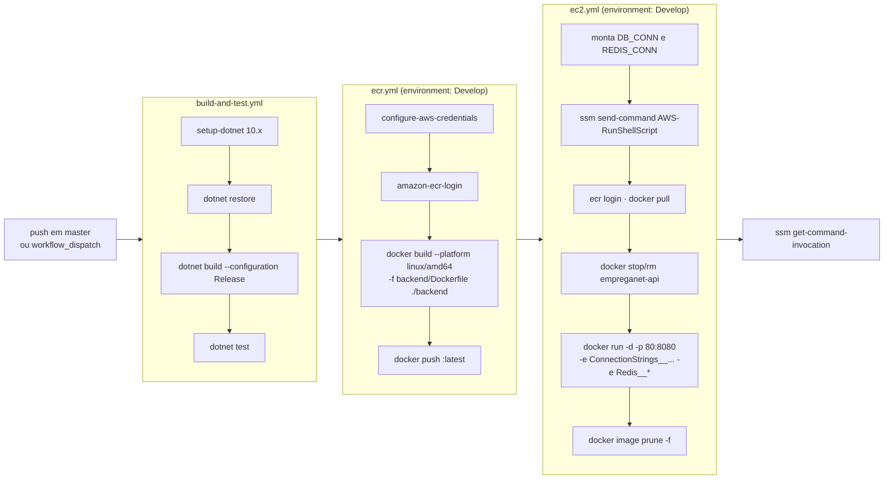
```mermaid
flowchart LR
  PUSH["push em master<br/>ou workflow_dispatch"] --> CI

  subgraph CI["build-and-test.yml"]
    C1["setup-dotnet 10.x"] --> C2["dotnet restore"] --> C3["dotnet build --configuration Release"] --> C4["dotnet test"]
  end

  CI --> ECR

  subgraph ECR["ecr.yml (environment: Develop)"]
    E1["configure-aws-credentials"] --> E2["amazon-ecr-login"] --> E3["docker build --platform linux/amd64<br/>-f backend/Dockerfile ./backend"] --> E4["docker push :latest"]
  end

  ECR --> EC2

  subgraph EC2["ec2.yml (environment: Develop)"]
    D1["monta DB_CONN e REDIS_CONN"] --> D2["ssm send-command AWS-RunShellScript"]
    D2 --> D3["ecr login · docker pull"] --> D4["docker stop/rm empreganet-api"]
    D4 --> D5["docker run -d -p 80:8080<br/>-e ConnectionStrings__... -e Redis__*"] --> D6["docker image prune -f"]
  end

  EC2 --> LOGS["ssm get-command-invocation"]
```

---

## 18. Convenções do projeto

### 18.1 Gerais

| Tema | Convenção |
| ---- | --------- |
| Idioma | Documentação, comentários, mensagens de erro e commits em **pt-BR**; identificadores de código em **inglês** |
| Commits | Estilo Conventional Commits — `feat:`, `fix:`, `refactor:`, `docs:`, `perf:` (ver `git log`) |
| Branch principal | `master` |
| Segredos | **Nunca** no repositório. `appsettings*.json` e `.env` são gitignorados; use user-secrets ou variáveis de ambiente |
| Decisões estruturais | ADR curto em `docs/sdd/adrs/NNNN-titulo-curto.md` |
| Features novas | Fluxo SDD (PRD → design → spec/tasks) em `docs/features/<feature-id>/` antes do código |

### 18.2 Backend (.NET)

| Tema | Convenção |
| ---- | --------- |
| Nomenclatura | `PascalCase` para tipos e membros públicos; `_camelCase` para campos privados |
| Sufixos | `*Command`, `*Query`, `*Handler`, `*Validator`, `*ViewModel`, `*Repository`, `*Options`, `*Enum` |
| Um handler por arquivo | O `record` do command/query fica no mesmo arquivo do handler (`LoginUserHandler.cs` contém `LoginUserCommand`) |
| Validators | `Validator.cs` na pasta do caso de uso; registro automático por `AddValidatorsFromAssembly` |
| Mapeamento | Extension method `ToViewModel()` em classe `*Mapper` estática, marcada `[ExcludeFromCodeCoverage]`. **Sem AutoMapper** |
| Mediator | Sempre `EmpregaNet.Domain.Libs.Mediator`. **Não introduza MediatR** |
| Transações | Marque o command com `ITransactional` — o `TransactionBehavior` faz o resto |
| Cache | Leitura opt-in com `[OutputCache(PolicyName = ...)]`; invalide via `IOutputCacheManager` na mutação |
| Nullable | `<Nullable>enable</Nullable>` em todos os projetos |
| Documentação XML | `GenerateDocumentationFile` ligado; `<summary>` alimenta o Swagger |
| `ProducesResponseType` | Declare todos os status possíveis, com `Type = typeof(DomainError)` nos erros |
| Serialização | MVC responde **camelCase**. Um `JsonConvert.SerializeObject` direto produz PascalCase e engana em testes |
| Migrations | Sempre versionadas, em `Infra/Persistence/Migrations` |

### 18.3 Frontend (Next.js / TypeScript)

| Tema | Convenção |
| ---- | --------- |
| Arquivos | `kebab-case` para módulos e features (`jobs-api.ts`, `route-access-guard.tsx`); `PascalCase` para componentes do design system (`Button.tsx`, `DataTable.tsx`) |
| Pastas | `kebab-case`; nomes de rota em **português** (`/vagas`, `/candidaturas`, `/conta/seguranca`) |
| Componentes | Um por arquivo, exportado nomeado; `index.ts` como barrel da pasta |
| `'use client'` | Só onde há interatividade/hooks. Páginas em `app/` preferem Server Component |
| `'server-only'` | Módulos server-side (`*-server.ts`) importam `'server-only'` e **nunca** entram no barrel |
| Tipos | `strict: true`, **`any` proibido**. Respostas da API entram como `unknown` e passam por `schema.parse` |
| Estilos | SCSS Modules (`*.module.scss`). **Não expandir Tailwind** |
| Imports | Sempre pelos aliases (`@/components`, `@/utils`, `@/shared`, `@/features/...`) |
| Formulários | `FormProvider` + schema Zod + campos de `form-fields/` |
| Mutations | `onError` sempre com `reportMutationApiError`; invalide as query keys em `onSuccess` |
| Query keys | Fábrica hierárquica em `*-keys.ts` — nunca arrays literais espalhados |
| Enums da API | Mapeados em um único lugar (`user-types.ts`, `JOB_TYPE_OPTIONS`) |
| Prettier | `printWidth: 120`, `singleQuote: true`, `semi: true`, `trailingComma: 'none'` |
| Gerenciador | **pnpm 9.15.9** — `package-lock.json`, `yarn.lock` e `pnpm-lock.yaml` estão no `.gitignore` |

---