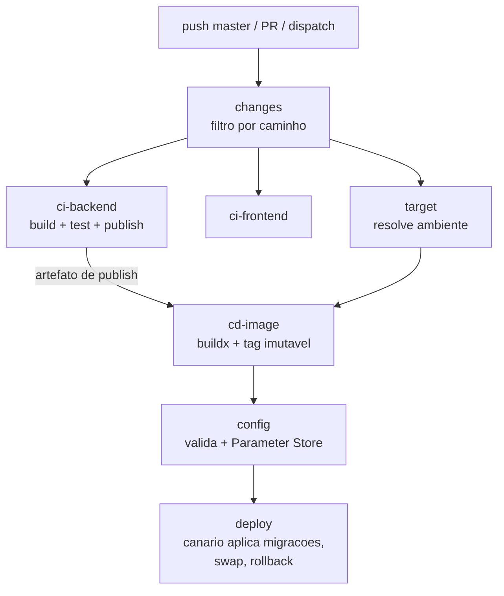

# Auditoria da pipeline de CI/CD

**Data:** 2026-08-04
**Escopo:** `.github/workflows/` e tudo que participa da publicação da API (`backend/Dockerfile`, `backend/.dockerignore`, `backend/docker-compose.yml`, `appsettings*.json`, `Program.cs`, validações de boot).
**Commit auditado:** `54e57b4`

---

## 1. Sumário executivo

A pipeline anterior tinha uma topologia razoável — workflows reutilizáveis, ECR, deploy por SSM sem SSH — mas um defeito que anula o resto:

> **A imagem publicada não conseguia iniciar, e a pipeline reportava sucesso.**

A cadeia:

1. `backend/.gitignore:6` ignora `appsettings*.json`. Confirmado: `git ls-files` só rastreia `appsettings.example.json`, e o histórico nunca teve os outros.
2. Logo, o checkout do runner **não tem** `appsettings.json`, e a imagem construída a partir dele **não tem configuração nenhuma** embutida.
3. `ec2.yml` injetava exatamente três variáveis: connection string, `Redis__Enabled` e `Redis__ConnectionString`.
4. Sem `ASPNETCORE_ENVIRONMENT`, o ASP.NET assume `Production`.
5. `EmpregaNet.Infra/DependencyInjection.cs:24` chama `EnsureJwtKeyIsStrongEnough` como **primeira** instrução de `RegisterCoreDependencies`. Sem `JwtSettings:SecretKey`, lança `InvalidOperationException` e o processo morre antes de abrir a porta.
6. `--restart always` reinicia o container, que morre de novo. **Crash loop permanente.**
7. `ec2.yml` fazia `sleep 10` e imprimia `get-command-invocation` **sem checar o status**. O step sempre retornava 0. **Job verde.**

Ou seja: o `docker run` era disparado com êxito, e era só isso que a pipeline verificava. Mesmo que a chave JWT existisse, o boot ainda pararia adiante — `CorsPolicyConfig.cs:29` exige origens CORS fora de Development e `DependencyInjection.cs:99` exige `Smtp:Enabled=true` com host e remetente em Production.

Além disso, **migrações nunca eram aplicadas em produção**: `Program.cs:22` só chama `ApplyPendingMigrations()` em `Development` ou `Staging`, e não havia etapa de schema na pipeline.

Não foi encontrado vazamento de credencial no repositório. `appsettings.Development.json` contém uma senha SMTP real (Brevo), mas o arquivo é ignorado pelo git e **nunca foi commitado** — verificado com `git log --all` no caminho. Ainda assim, vale rotacionar: um `git add -f` acidental basta para publicá-la.

---

## 2. Inventário do estado anterior

| Arquivo | Papel | Linhas | Veredito |
|---|---|---|---|
| `main-deploy.yml` | Orquestrador | 51 | Refatorado |
| `build-and-test.yml` | CI backend + BFF | 40 | Substituído por `ci-backend.yml`; a parte do BFF foi descontinuada |
| `frontend-ci.yml` | CI frontend | 39 | Substituído por `ci-frontend.yml` |
| `ecr.yml` | Build e push da imagem | 47 | Substituído por `cd-image.yml` |
| `ec2.yml` | Deploy via SSM | 71 | Substituído por `cd-ec2.yml` |

---

## 3. Riscos identificados

Severidade: **C** crítico · **A** alto · **M** médio · **B** baixo

### Correção e disponibilidade

| ID | Sev | Achado | Evidência |
|---|---|---|---|
| R-01 | **C** | Deploy podia falhar sem falhar o job: nenhum passo checava o resultado do SSM | `ec2.yml:56-64` |
| R-02 | **C** | Container não subia em `Production` por falta de configuração obrigatória | `ec2.yml:29-51` + `Infra/DependencyInjection.cs:24,99` + `CorsPolicyConfig.cs:29` |
| R-03 | **C** | Migrações nunca aplicadas no ambiente publicado — *resolvido no código: `ApplyPendingMigrations` passou a ser incondicional, ver §6.6* | `Program.cs:22-25` |
| R-04 | **A** | Rollback impossível: imagem publicada só com a tag `latest` | `ecr.yml:40` |
| R-05 | **A** | `docker stop` → `rm` → `run` sem verificação de saúde: sem canário, sem gate, sem reversão | `ec2.yml:48-50` |
| R-06 | **M** | Sem `concurrency`: dois pushes disputavam a porta 80 e o nome do container | ausente |
| R-07 | **M** | CI do frontend não bloqueava nada e o frontend não era publicado em lugar nenhum | `main-deploy.yml:17-20` |
| R-08 | **B** | `docker image prune -f` no fim do deploy removia a imagem anterior, que seria o alvo do rollback | `ec2.yml:51` |

### Segurança

| ID | Sev | Achado | Evidência |
|---|---|---|---|
| R-09 | **C** | Senha do banco interpolada no texto do comando SSM. O comando fica no histórico do Systems Manager e nos parâmetros do CloudTrail, legível por qualquer principal com `ssm:ListCommands`/`GetCommandInvocation` | `ec2.yml:29` |
| R-10 | **A** | Credencial AWS estática de longa duração em vez de OIDC | `ecr.yml:26-29`, `ec2.yml:20-23` |
| R-11 | **A** | `secrets: inherit` entregava **todos** os segredos do repositório aos workflows chamados | `main-deploy.yml:27,36` |
| R-12 | **M** | Nenhum bloco `permissions`: o `GITHUB_TOKEN` recebia o default do repositório | ausente em todos |
| R-13 | **M** | Container executando como `root` | `backend/Dockerfile` (sem `USER`) |
| R-14 | **B** | Actions presas a tag flutuante de major (`@v4`), não a SHA | todos |

### Build e performance

| ID | Sev | Achado | Evidência |
|---|---|---|---|
| R-15 | **A** | **Compilação dupla**: `build-and-test.yml` restaurava e compilava a solução inteira, o resultado era descartado, e `ecr.yml` recompilava tudo de novo dentro do Docker | `build-and-test.yml:32-35` vs `Dockerfile:17-20` |
| R-16 | **A** | Sem cache de NuGet: download completo a cada execução | ausente |
| R-17 | **A** | Sem cache de layers do Docker: `docker build` puro, sem buildx | `ecr.yml:44` |
| R-18 | **M** | `dotnet test` sem `--no-build`: terceira compilação da mesma árvore | `build-and-test.yml:42` |
| R-19 | **M** | Build do BFF em série dentro do job do backend, somando ao caminho crítico | `build-and-test.yml:37-39` |
| R-20 | **M** | Sem filtro de caminho: mudança só no frontend disparava build e deploy do backend | ausente |
| R-21 | **M** | `Dockerfile` copia `src/` e `tests/` **antes** do `restore`, invalidando a camada de restore a cada alteração de código | `Dockerfile:13-17` |
| R-22 | **B** | `tests/` entra no contexto e é restaurado para uma imagem que só publica a API | `Dockerfile:15` |
| R-23 | **B** | Resultados de teste não publicados; nenhum `.trx`, nenhuma cobertura | `build-and-test.yml:42` |
| R-24 | **B** | Sem versionamento: assemblies saíam como `1.0.0.0` | ausente |
| R-30 | **B** | O BFF era compilado a cada execução sem ter testes nem etapa de publicação — trabalho de CI sem consumidor | `build-and-test.yml:37-39` |

### Configuração

| ID | Sev | Achado | Evidência |
|---|---|---|---|
| R-25 | **A** | `NEXT_PUBLIC_API_BASE_URL: http://localhost:5225` fixo no workflow. Sendo `NEXT_PUBLIC_*`, o valor é inlinado no bundle e não há como corrigi-lo pós-build | `frontend-ci.yml:43-44` |
| R-26 | **A** | Nome do container, porta e repositório ECR fixos no código do workflow | `ec2.yml:32-33`, `ecr.yml:12` |
| R-27 | **M** | `environment: Develop` fixo dentro dos workflows chamados: impossível ter Homologação e Produção sem duplicar arquivos | `ecr.yml:17`, `ec2.yml:16` |
| R-28 | **M** | `ASPNETCORE_ENVIRONMENT` nunca definido | `ec2.yml:50` |
| R-29 | **B** | 30 linhas de código morto comentado no orquestrador | `main-deploy.yml:38-56` |

---

## 4. O que estava certo e foi mantido

Nem tudo precisava mudar. Estas decisões foram preservadas de propósito:

- **Deploy via SSM, não SSH.** É a decisão mais acertada do desenho anterior. Dispensa porta 22 aberta, dispensa chave privada como segredo do GitHub e a autorização passa por IAM, com registro no CloudTrail. Mantido integralmente.
- **ECR como registro.** Autenticação por IAM, sem senha de registro para guardar. Mantido.
- **Workflows reutilizáveis com `workflow_call`.** A separação orquestrador/executor já estava correta; foi aprofundada, não substituída.
- **Outputs entre jobs para propagar `image_uri`/`ecr_registry`.** Padrão certo. Mantido e estendido.
- **`environment:` do GitHub nos jobs de deploy.** É o gancho para aprovação manual e para segregar segredos. Mantido, mas parametrizado.
- **Alpine + `icu-libs` no runtime.** Imagem pequena com globalização real, que a API precisa para formatar pt-BR. `DOTNET_SYSTEM_GLOBALIZATION_INVARIANT=false` está correto e continua.
- **`backend/.dockerignore`.** Cobre `bin`, `obj`, `.vs`, `node_modules` e `.env`. Adequado, sem alteração.
- **`appsettings*.json` fora do git.** É o motivo de o repositório estar limpo de segredos. A causa do incidente não é essa regra — é a pipeline não ter assumido a contrapartida de injetar tudo por variável de ambiente.
- **Separação `/health/live` e `/health/ready` na API.** Já existia e é exatamente o que o novo deploy precisava para funcionar. O gate usa `ready` (banco e Redis); o `HEALTHCHECK` do container usa `live`, para que uma queda de Redis não provoque reinício em laço.

---

## 5. Arquitetura proposta



`ci-backend` e `ci-frontend` rodam em paralelo. `cd-image` consome o artefato de `ci-backend` em vez de recompilar.

### Arquivos

```
.github/
├── actions/
│   ├── aws-auth/action.yml          # composite: OIDC com fallback para chave estática
│   └── dotnet-setup/action.yml      # composite: SDK + cache de NuGet
├── scripts/
│   ├── deploy-container.sh          # executa na instância: canário, swap, rollback
│   └── wait-ssm-command.sh          # aguarda o SSM e propaga o resultado
└── workflows/
    ├── main-deploy.yml              # orquestrador
    ├── ci-backend.yml               # build, testes, publish, script de migrações
    ├── ci-frontend.yml              # lint, format, testes, build
    ├── cd-image.yml                 # imagem a partir do artefato, tag imutável
    └── cd-ec2.yml                   # config → migrate → deploy
backend/
└── Dockerfile                       # multi-stage: alvos `local` e `prebuilt`
```

---

## 6. Mudanças, uma a uma

### 6.1 O deploy agora pode falhar

`wait-ssm-command.sh` faz polling do `get-command-invocation` até um estado terminal, imprime `StandardOutputContent` e `StandardErrorContent` e **retorna diferente de zero** se o status não for `Success`.

O waiter nativo (`aws ssm wait command-executed`) não serve: desiste em ~100 s, curto demais para um deploy com canário.

Os códigos de saída distinguem o que aconteceu, o que muda a resposta ao incidente:

| Código | Significado | Produção |
|---|---|---|
| 20 | Canário não subiu | **Intacta** — nada foi tocado |
| 21 | Imagem nova falhou, rollback deu certo | Restaurada na versão anterior |
| 22 | Rollback também falhou | **Fora do ar** |
| 23 | Falhou e não havia versão anterior | **Fora do ar** |
| 30 | Digest do script de migração divergiu | Intacta |

**Resolve:** R-01.

### 6.2 Canário antes de encostar em produção

`deploy-container.sh` sobe a imagem nova em `127.0.0.1:8081`, com a configuração real e contra o banco e o Redis reais, e só promove depois que `/health/ready` responde.

É esta etapa que impede a repetição do incidente: uma imagem que não consegue iniciar por falta de configuração morre no canário, com os logs do container no output do job, e o container que atende tráfego **nunca é parado**.

O seeder de Identity é idempotente, então rodá-lo no canário não duplica dados.

**Resolve:** R-02, R-05.

### 6.3 Tag imutável e rollback

A imagem passa a ser publicada com três tags: `sha-<commit>` (imutável), `v<versão>` e `latest`. O deploy usa **sempre** a tag imutável.

Isso é o que torna o rollback possível: antes de promover, o script lê `docker inspect -f '{{.Config.Image}}'` do container em execução e guarda a referência em `/var/lib/empreganet/previous-image`. Se a verificação de saúde na porta de produção falhar, ele volta para essa imagem e revalida.

Com `latest` sozinho não existe nome para a versão anterior — era literalmente impossível reverter.

O `docker image prune -f` foi movido para **depois** do sucesso, e o `--restart always` virou `unless-stopped`.

**Resolve:** R-04, R-08.

### 6.4 Segredos saem do texto do comando SSM

Esta é a correção de segurança mais importante.

**Antes:** a senha do banco era interpolada na string do comando. O texto de um `send-command` fica retido no histórico do Systems Manager e nos parâmetros do CloudTrail.

**Agora:**

1. O job `config` monta o arquivo de ambiente no runner, a partir dos GitHub Secrets/Variables.
2. Grava no SSM Parameter Store como `SecureString`, via `--value file://...` — o valor não passa por `argv`, e o CloudTrail oculta o `Value` de `SecureString`.
3. O script enviado à instância carrega apenas o **nome** do parâmetro.
4. A instância resolve o conteúdo com a própria instance role e escreve em `/etc/empreganet/api.env` com modo `600`.
5. O container recebe tudo por `--env-file`.

Nenhum segredo trafega no texto do comando. O log do job imprime apenas os **nomes** das chaves geradas, nunca os valores.

**Resolve:** R-09.

### 6.5 Configuração completa, validada antes do deploy

O job `config` monta ~35 chaves cobrindo todas as seções de `appsettings.json`: `ConnectionStrings`, `JwtSettings`, `AppUrls` (com expansão de arrays em `__0`, `__1`, …), `GoogleAuth`, `Smtp`, `Seed`, `RateLimiting`, `ForwardedHeaders`, `Sentry`, `Redis`, `OutputCache`, `EmailThrottle`, `Logging`.

Chave vazia é **omitida**, e aí vale o default definido nas classes de Options em C#. A pipeline só declara o que difere do padrão.

Antes de qualquer chamada à AWS, o step de validação replica as regras de boot da API e falha com mensagem própria:

- `JWT_SECRET_KEY` presente **e** com no mínimo 32 bytes (espelha `EnsureJwtKeyIsStrongEnough`);
- `CORS_ALLOWED_ORIGINS` obrigatório fora de Development (espelha `CorsPolicyConfig`);
- SMTP completo quando o alvo é Production (espelha `EnsureSmtpConfiguredForProduction`).

Descobrir isso num job vermelho custa uma execução; descobrir no boot custa indisponibilidade.

`ASPNETCORE_ENVIRONMENT` passa a ser explícito.

**Resolve:** R-02, R-26, R-28.

### 6.6 Migrações

> Revisado em 2026-08-04, após a decisão de tornar `ApplyPendingMigrations` incondicional em `Program.cs`. A proposta original tinha um job `migrate` dedicado (S3 + `psql`); ele foi removido por ter virado redundante.

O `if (IsDevelopment() || IsStaging())` que envolvia `ApplyPendingMigrations()` saiu. A aplicação agora aplica migrações pendentes no boot em qualquer ambiente, o que resolve R-03 no código, e não na pipeline.

Isso alinha duas coisas que estavam em desacordo: `Program.cs` já chamava `IdentityDataSeeder.SeedAsync` incondicionalmente, e o seeder pressupõe que as tabelas existem. Antes, em `Production`, as migrações não rodavam mas o seed sim.

**Quem aplica é o canário.** Ele sobe antes da produção, contra o banco real, então:

- uma migração que falha derruba o canário, e o container em produção **nem chega a ser parado**;
- quando a produção sobe, o schema já está pronto — por isso o teto de espera da promoção é menor que o do canário.

A pipeline continua gerando `migrations.sql` com `dotnet ef migrations script --idempotent` a cada execução, guardado como artefato por 30 dias. Não é usado para aplicar nada: serve para o delta de schema ficar visível na revisão do PR.

**Duas consequências que precisam estar registradas:**

1. **Rollback vira assimétrico com DDL destrutivo.** O canário já aplicou a migração; se a promoção falhar depois, o script volta para a imagem anterior, mas o schema ficou à frente. Para migração aditiva, inofensivo. Para `RenameColumn` ou `DropColumn`, o código antigo consulta coluna que não existe e o rollback não restaura o serviço — o script sai com código 22.

   Isso **não é hipotético neste repositório**: `20260802164402_FeedVagasJobEnriquecido.cs:42` renomeia `Salary` → `SalaryMin`, e `20260803002258_FeedVagasPerfilIndustrial.cs:12,24` renomeiam `Technologies` → `Requirements` e `Seniority` → `ExperienceLevel`.

   Enquanto expand/contract não for adotado (adicionar coluna nova, backfill, escrever nos dois, dropar num release seguinte), a regra é: **release com rename ou drop é forward-only.** Se der errado, corrige e sobe de novo — não volta. O script avisa disso no log e no resumo do job.

2. **O usuário de banco da aplicação precisa de DDL permanentemente.** Antes ele poderia ser só DML em produção. Agora um SQL injection ou RCE na API escala para alteração de schema. É o preço conhecido do `Migrate()` no boot; vale um ADR registrando a escolha.

**Resolve:** R-03 (no código).

### 6.7 Compilação única

Era o maior desperdício: a solução inteira era compilada no runner, o resultado descartado, e tudo recompilado dentro do Docker.

Agora `ci-backend` compila uma vez e publica `dotnet publish` como artefato. `cd-image` baixa esse artefato e monta a imagem sem recompilar nada.

Os dois modos de build vivem em **um único** `backend/Dockerfile`, selecionados por `--target`:

| Alvo | Consumidor | Contexto | O que faz |
|---|---|---|---|
| `local` | `docker-compose` | `backend/` | compila com o SDK dentro do container e roda |
| `prebuilt` | `cd-image` | `image-context/` | copia o `publish/` que passou nos testes |

Ambos herdam do estágio `runtime`, que é a **única** definição de como a API executa — mesma tag base, ICU, TZ, porta, `USER $APP_UID` e healthcheck. Um segundo arquivo (`Dockerfile.ci`) foi a primeira tentativa e foi descartado: duplicar o estágio de runtime deixa a imagem do dev e a de produção livres para divergir em silêncio, que é exatamente o risco que o compartilhamento remove. Rodar como root apenas localmente, por exemplo, esconde falhas de permissão que só apareceriam em produção.

Compilar dentro do container continua sendo o comportamento certo na máquina do dev; o BuildKit só avalia os estágios alcançados pelo `--target`, então o estágio de build nunca é executado no CD e o contexto de lá pode conter apenas os binários.

Compilação consistente entre build, test e publish: `-p:UseAppHost=false` é passado nos três, o que é o que permite `--no-build` reaproveitar de verdade a saída do build.

**Resolve:** R-15, R-18, R-21, R-22.

### 6.8 Cache

- **NuGet:** `actions/cache` sobre `NUGET_PACKAGES`, com chave por hash dos `.csproj`. O prefixo da chave é parâmetro do composite, para que soluções distintas não sobrescrevam o cache uma da outra.
- **Layers do Docker:** buildx com `cache-from`/`cache-to: type=gha,mode=max`.
- **pnpm:** já existia via `setup-node`, mantido.

O cache de NuGet usa `.csproj` porque o projeto não adota `packages.lock.json`. É menos preciso que um lockfile — um bump para uma versão flutuante não muda a chave — e ainda assim elimina o download completo. Adotar `RestorePackagesWithLockFile` melhoraria a precisão, mas é mudança de projeto, fora do escopo desta auditoria.

**Resolve:** R-16, R-17.

### 6.9 Paralelismo e filtros de caminho

- **O BFF saiu da pipeline.** Decisão do projeto, definitiva: a solução era compilada a cada execução sem ter testes nem alvo de publicação, e o frontend consome a API diretamente. `Bff/` não aparece em nenhum filtro de caminho — alteração restrita a essa pasta não dispara job algum. Resolve R-19 e R-30 eliminando o trabalho, não paralelizando-o.
- `lint` e `format:check` rodam em paralelo dentro do mesmo step.
- O job `changes` decide, por `git diff`, o que precisa rodar. Mudança só em `frontend/` não dispara build nem deploy do backend. Mudança em `.github/` revalida tudo.

A detecção usa `git diff` nativo em vez de uma action de terceiro: é uma dependência a menos na cadeia de suprimentos para uma lógica de dez linhas. Trata os casos de borda — `before` zerado no primeiro push, commit ausente após force-push — assumindo "tudo mudou".

**Resolve:** R-19, R-20.

### 6.10 Permissões e autenticação

- `permissions: {}` no topo de todos os workflows; cada job pede o mínimo (`contents: read`, e `id-token: write` só onde há OIDC).
- `secrets: inherit` substituído por **mapeamento explícito**.
- `aws-auth` prefere OIDC via `vars.AWS_ROLE_ARN`. Enquanto a role não existir, cai para chave estática e **emite aviso no log** — a migração pode ser feita sem interromper os deploys.
- `sts get-caller-identity` logo após o login: falha cedo e com mensagem clara se a credencial não valer nada.
- Container roda como usuário sem privilégio (`USER $APP_UID`, uid 1654, no estágio `runtime` do `backend/Dockerfile`) — vale tanto para a imagem publicada quanto para a do `docker-compose`.

**Resolve:** R-10, R-11, R-12, R-13.

### 6.11 Ambientes

`environment` deixou de ser fixo e virou input. O mesmo par `cd-image` + `cd-ec2` serve Develop, Homologação e Produção; o que muda é o GitHub Environment de onde vêm `vars` e `secrets`.

| Evento | Environment | `ASPNETCORE_ENVIRONMENT` | Migrações |
|---|---|---|---|
| PR → master | nenhum (só CI) | — | — |
| push → master | `Develop` | `Staging` | no boot |
| `workflow_dispatch` | escolhido | `Production` só em Production | input |

`Staging` em Develop é deliberado: é o valor que faz `Program.cs` aplicar migrações no boot e que dispensa a exigência de SMTP real, que só vale em Production.

Adicionar um quarto ambiente é criar o GitHub Environment com suas variáveis. Nenhum arquivo novo.

**Resolve:** R-27.

### 6.12 Qualidade

- `concurrency` por ambiente no job de deploy, com `cancel-in-progress: false` — abortar um deploy no meio do swap deixaria o host sem container nenhum. Nos PRs, `cancel-in-progress: true`.
- `timeout-minutes` em todos os jobs.
- Resultados de teste (`.trx` + cobertura) publicados como artefato, inclusive quando falham.
- Versionamento: `1.0.<run_number>`, com o SHA no `InformationalVersion` e nos labels OCI da imagem.
- `$GITHUB_STEP_SUMMARY` com tag, digest, ambiente e `CommandId`.
- Código morto comentado removido.
- Nomenclatura uniforme: prefixos `ci-`/`cd-`, verbo no nome do job.
- Guarda-corpo no CI: falha se algum `appsettings*.json` entrar no publish, para que configuração nunca volte a viajar dentro da imagem.
- Um step de `tsc --noEmit` foi **deliberadamente não adicionado**: o `tsconfig.json` inclui `**/*.ts` e `next.config.ts` não define `typescript.ignoreBuildErrors`, então `next build` já faz essa checagem sobre o mesmo escopo. Seria a mesma verificação paga duas vezes.

**Resolve:** R-06, R-23, R-24, R-25, R-29.

---

## 7. Comparação

| Dimensão | Antes | Depois |
|---|---|---|
| Deploy quebrado falha o job | **Não** | Sim, com código de saída por cenário |
| Container inicia em produção | **Não** (crash loop) | Validado no canário antes de promover |
| Rollback | Impossível (só `latest`) | Automático, para a tag imutável anterior |
| Migrações em produção | **Nunca aplicadas** | Aplicadas no boot, validadas pelo canário antes da promoção |
| Senha do banco | No histórico do SSM/CloudTrail | `SecureString`, resolvida pela instance role |
| Credencial AWS | Chave estática | OIDC, com fallback avisado |
| Escopo dos segredos | `secrets: inherit` (todos) | Mapeamento explícito |
| `permissions` | Default do repositório | `{}` no topo, mínimo por job |
| Usuário do container | root | sem privilégio |
| Compilações por execução | 3 (build, test, Docker) | 1 |
| Cache NuGet / Docker | Nenhum | `actions/cache` / buildx GHA |
| Build do BFF | Série, sem testes nem deploy | Removido da pipeline |
| Filtro de caminho | Nenhum | Por área |
| Chaves de configuração injetadas | 3 | ~35, validadas antes |
| `ASPNETCORE_ENVIRONMENT` | Não definido | Explícito por ambiente |
| Ambientes suportados | 1, fixo no código | N, por input |
| Concorrência | Sem controle | Serializada por ambiente |
| Resultados de teste | Descartados | Artefato com cobertura |
| Versionamento | `1.0.0.0` | `1.0.<run>` + SHA + labels OCI |

Estimativa de tempo: a eliminação da compilação dupla mais os caches deve reduzir substancialmente o caminho crítico do backend. **Não foi medido** — nenhuma execução real foi feita nesta auditoria, e o número depende do estado do cache. Meça as duas primeiras execuções antes de citar qualquer percentual.

---

## 8. Pré-requisitos antes do primeiro deploy

A pipeline nova **falha de propósito** se algo abaixo faltar. É o comportamento desejado: melhor um job vermelho que um crash loop silencioso.

### 8.1 Variables por Environment

| Nome | Obrigatória | Exemplo |
|---|---|---|
| `AWS_REGION` | sim | `us-west-2` |
| `EC2_INSTANCE_ID` | sim | `i-0abc…` |
| `DB_HOST` / `DB_NAME` | sim | |
| `DB_PORT` | não (5432) | |
| `CORS_ALLOWED_ORIGINS` | sim fora de Development | `https://app.exemplo.com,https://www.exemplo.com` |
| `PUBLIC_APP_BASE_URL` | recomendada | base dos links de e-mail |
| `SMTP_HOST` / `SMTP_FROM_EMAIL` | sim em Production | |
| `SMTP_PORT` / `SMTP_SECURITY` / `SMTP_FROM_NAME` / `SMTP_ENABLED` | não | |
| `AWS_ROLE_ARN` | não, mas **recomendada** | ativa OIDC |
| `JWT_ISSUER` / `JWT_AUDIENCE` / `JWT_EXPIRATION_HOURS` / `JWT_REFRESH_TOKEN_EXPIRATION_DAYS` | não | |
| `SEED_ADMIN_EMAIL` / `SEED_ADMIN_USERNAME` | não | |
| `RATE_LIMITING_*`, `FORWARDED_KNOWN_PROXIES`, `FORWARDED_KNOWN_NETWORKS` | não | listas em CSV |
| `GOOGLE_CLIENT_IDS` | não | CSV |
| `LOG_LEVEL_DEFAULT`, `OUTPUT_CACHE_*`, `EMAIL_THROTTLE_MAX_PER_DAY`, `ALLOWED_HOSTS` | não | |
| `CONTAINER_NAME` / `APP_HOST_PORT` / `CANARY_HOST_PORT` | não | `empreganet-api` / `80` / `8081` |
| `CANARY_TIMEOUT_SECONDS` | não (300) | teto de espera do canário; aumente se houver migração longa |
| `PROMOTE_TIMEOUT_SECONDS` | não (120) | teto do boot em produção (schema já migrado) |
| `STOP_GRACE_SECONDS` | não (30) | SIGTERM antes de SIGKILL ao trocar o container |
| `NEXT_PUBLIC_API_BASE_URL` | recomendada | |

### 8.2 Secrets por Environment

| Nome | Obrigatório |
|---|---|
| `DB_USERNAME`, `DB_PASSWORD` | sim |
| `JWT_SECRET_KEY` | sim, ≥ 32 bytes |
| `SMTP_USERNAME`, `SMTP_PASSWORD` | sim em Production |
| `SEED_ADMIN_PASSWORD` | só no primeiro provisionamento |
| `SENTRY_DSN`, `REDIS_HOST`, `OPENAI_API_KEY` | conforme uso |
| `AWS_ACCESS_KEY_ID`, `AWS_SECRET_ACCESS_KEY` | só enquanto `AWS_ROLE_ARN` não existir |

> `SEED_ADMIN_PASSWORD` vazio faz o usuário admin **não** ser criado. É o default seguro. Preencha só no primeiro deploy de um ambiente e remova depois.

### 8.3 Permissões da instance role (EC2)

A instância passa a resolver os próprios segredos, então precisa de:

- `ssm:GetParameter` em `arn:aws:ssm:<região>:<conta>:parameter/empreganet/*`
- `kms:Decrypt` na chave que cifra esses parâmetros
- `ecr:GetAuthorizationToken`, `ecr:BatchGetImage`, `ecr:GetDownloadUrlForLayer`

Na instância precisam existir `docker`, `curl` e AWS CLI v2.

### 8.4 Permissões do principal do GitHub Actions

`ssm:SendCommand`, `ssm:GetCommandInvocation`, `ssm:PutParameter`, `ecr:*` de push, e `kms:Encrypt` na chave dos parâmetros.

---

## 9. Adoção sugerida

1. Cadastrar Variables e Secrets no Environment `Develop`.
2. Ajustar a instance role (§8.3).
3. Disparar `workflow_dispatch` com `environment=Develop`. Um canário que falha não afeta nada — é o teste mais barato disponível.
4. Criar a role OIDC, definir `AWS_ROLE_ARN`, confirmar que o aviso de credencial estática sumiu, **revogar as chaves**.
5. Rotacionar a senha SMTP do Brevo que está em `appsettings.Development.json`.
6. Criar o Environment `Production` com *required reviewers*.
7. Primeiro deploy em Production. Confirme antes se o release contém `RenameColumn`/`DropColumn` — nesse caso ele é forward-only (§6.6).

---

## 10. Limitações conhecidas

Declaradas explicitamente para que não sejam confundidas com garantias:

- **Não há zero-downtime real.** A janela de indisponibilidade é o tempo de boot de uma imagem já validada — segundos, não minutos, e nunca mais um crash loop. Mas num host único com `docker run`, a porta 80 só pode ser tomada por um container por vez. Zero-downtime de verdade exige um proxy à frente (Caddy ou nginx alternando entre `-blue` e `-green`), ou migrar para ECS/ALB. Ambos são mudança de infraestrutura, fora do escopo desta auditoria; o canário já entrega a maior parte do benefício, que é nunca promover uma imagem quebrada.
- **Rollback não cobre migração destrutiva.** Detalhado em §6.6. Enquanto expand/contract não for a prática, release com `RenameColumn`/`DropColumn` é forward-only, e o rollback automático deixa de ser rede de segurança para esse caso específico.
- **Nenhuma execução real foi feita.** Os workflows foram validados por parse de YAML, conferência dos contratos de input/output/secret entre workflows, `bash -n` nos steps de shell embutidos e `dash -n` no script de deploy (que é POSIX porque o agente do SSM usa `/bin/sh`). Isso não substitui uma execução.
- **Sem varredura de vulnerabilidade na imagem.** Habilitar *scan on push* no repositório ECR, ou adicionar Trivy, é recomendado — não foi incluído porque exige decisão sobre o que bloqueia o deploy.
- **Actions presas a tag de major** (R-14), não a SHA. Fixar por SHA elimina a janela de comprometimento de uma tag, ao custo de manutenção via Dependabot. Fica como decisão do time.
- **O frontend continua sem deploy.** A pipeline compila e testa, mas não publica em lugar nenhum (R-07 permanece aberto): não há Dockerfile no `frontend/`, nem alvo de hospedagem identificável no repositório. Definir isso é decisão de arquitetura, não de pipeline.
- **A saída do SSM é truncada em 24 000 caracteres** pelo `get-command-invocation`. Por isso o script limita os logs de container que imprime. Para investigação profunda, use o `CommandId` do resumo do job.
- **`ForwardedHeaders`**: nunca defina `ASPNETCORE_FORWARDEDHEADERS_ENABLED=true`. Isso limparia `KnownProxies`/`KnownNetworks` e reabriria spoofing de IP, burlando o rate limiter (ADR 0004). A pipeline injeta as listas explícitas e nunca essa variável.
