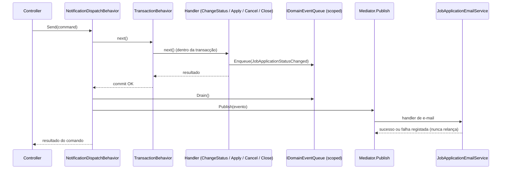

# Design — Acompanhamento da candidatura pelo candidato

**feature-id:** `emp-acompanhamento-candidatura` · **PRD:** [`prd.md`](prd.md) v1.1.0 (Approved)

Cobre as decisões técnicas de: notificação por e-mail do andamento (N1–N7), cancelamento pelo candidato
(X1–X6), estado inicial "Recebida" (D5) e as salvaguardas do encerramento terminal de vaga (V1–V3).

## 1. Restrições do código existente que condicionam o desenho

Levantadas no repositório, não presumidas:

| Fato | Consequência |
| ---- | ------------ |
| `JobApplication.Status` é persistido como **`integer`** (`InitialMigration.cs:161`) e `ApplicationStatusEnum` **não declara valores explícitos** | Novo status só pode ser **acrescentado no fim** do enum. Inserir no meio reescreveria o significado das linhas já gravadas |
| `JobApplication` nasce em `Processing` (`JobApplication.cs:23`) | D5 muda o construtor; linhas existentes **não** são retroactivamente alteradas (§7) |
| `ChangeStatus` não tem máquina de estados (`JobApplication.cs:27`) | Guardas novas entram apenas onde o PRD as exige (cancelamento e protecção do ato do candidato), não como máquina completa |
| `BaseEntity` já tem `UpdatedAt` | A data da mudança de status **não** precisa de coluna nova |
| Handlers `ITransactional` correm **dentro** da transacção (`TransactionBehavior.cs:38`) | O e-mail **não** pode ser enviado no corpo do handler: um rollback posterior deixaria o candidato informado de uma aprovação que não existe |
| O mediator interno já suporta `Publish` + `INotificationHandler<T>` (`Mediator.cs:35`), hoje **sem nenhum uso** | O despacho pós-commit activa mecanismo existente em vez de introduzir barramento novo |
| Behaviors registados por ordem: Performance → Validation → Transaction (`DependencyInjection.cs:123-125`) | O novo behavior de despacho precisa de ficar **fora** da transacção (registado antes de `TransactionBehavior`) |
| `IEmailSender` é resolvido para `NoOpEmailSender` em dev (`DependencyInjection.cs:46`) | Em dev nada é enviado; a verificação dos e-mails desta feature exige um sender de log/ficheiro (§9) |
| `EmpregaNetEmailTemplates` devolve `(subject, html)`; `AccountEmailService` só delega transporte | Padrão a seguir para os templates novos |
| `IEmailThrottleService` (5/dia por destinatário) é aplicado **só** em `forgot-password` e `resend-confirmation` | As notificações desta feature **não** passam por ele (W5) — ver §3.5 |

## 2. Contratos de domínio

### 2.1 `ApplicationStatusEnum` — acréscimo no fim

```csharp
public enum ApplicationStatusEnum
{
    [Description("")] NaoSelecionado,
    [Description("Aprovado")] Approved,
    [Description("Aguardando aprovação")] Pending,
    [Description("Rejeitado")] Rejected,
    [Description("Expirado")] Timeout,
    [Description("Vaga cancelada pela empresa")] Canceled,
    [Description("Erro")] Error,
    [Description("Em Análise")] Processing,
    [Description("Encerrado")] Finished,
    [Description("Cancelada pelo candidato")] CanceledByCandidate,   // novo — sempre no fim
}
```

`Canceled` mantém o significado actual (**ato da empresa**); `CanceledByCandidate` é o **ato do candidato**.
Distinguir por status, e não por coluna de autoria, satisfaz CA-15 sem migration de dados e mantém
filtro e agregação por status a funcionar sem *join*.

`Pending` passa a ter uso real (D5); o seu texto muda de "Aguardando aprovação" para **"Recebida"**, alinhando
com o vocabulário do PRD e com o que o candidato vê.

**Isto não é quebra de contrato de leitura.** O frontend mapeia status pelo **nome do enum**, não pela
`Description` — `applicationStatusSchema` é um `z.enum` sobre `['Pending', 'Processing', ...]`
([`application-status.ts`](../../../frontend/src/features/candidaturas/domain/application-status.ts)) — e já
rotula `Pending` como "Recebida". O vocabulário do frontend estava, portanto, à frente do backend: faltava
apenas o domínio produzir o estado.

**Consequência que obriga a entrega conjunta** *(corrigido em v1.0.1 após verificação no código — a
redacção anterior exagerava o modo de falha)*: o contrato de leitura usa `status: z.string()`, **não** o
`z.enum`, portanto um valor desconhecido **não** faz o `parse` falhar. `parseApplicationStatus` devolve
`null` e `ApplicationStatusBadge` cai no *fallback*: mostra o identificador cru (`CanceledByCandidate`), em
tom neutro. A falha é **cosmética** — o candidato vê um identificador em inglês em vez do rótulo pt-BR e
perde a cor do estado — não é ecrã partido nem erro de parse.

A entrega conjunta continua a ser o que se quer, mas por qualidade de apresentação, não por risco de
quebra. Calibrar a decisão de *release* por esse risco real, não por um mais grave do que existe.

### 2.2 `JobApplication` — invariantes

```csharp
public JobApplication(long jobId, long userId)   // D5: nasce em Recebida
{
    JobId = jobId;
    UserId = userId;
    Status = ApplicationStatusEnum.Pending;
    AppliedAt = DateTimeOffset.UtcNow;
}

/// Ato do candidato. Permitido só em Pending e Processing (X1, X2).
public void CancelByCandidate()
{
    if (Status is not (ApplicationStatusEnum.Pending or ApplicationStatusEnum.Processing))
        throw new InvalidOperationException("Esta candidatura não pode mais ser cancelada.");

    Status = ApplicationStatusEnum.CanceledByCandidate;
}
```

`ChangeStatus` (ato do recrutador) ganha **duas** guardas, apenas as que o PRD exige:

| Guarda | Motivo |
| ------ | ------ |
| Recusa `newStatus == CanceledByCandidate` | RBAC-2: o recrutador não cancela em nome do candidato |
| Recusa qualquer transição **a partir de** `CanceledByCandidate` | X3/X6: o ato do candidato é terminal e não é sobreposto pela empresa |

**Não** se introduz máquina de estados completa para as transições do recrutador — não é requisito do PRD.
Fica em §10 como item adiado, com gatilho.

### 2.3 Evento de domínio

```csharp
// EmpregaNet.Application/JobApplications/Events/
public sealed record JobApplicationStatusChanged(
    long JobApplicationId,
    long JobId,
    long CandidateUserId,
    ApplicationStatusEnum PreviousStatus,
    ApplicationStatusEnum NewStatus,
    DateTimeOffset OccurredAt,
    JobApplicationNotificationReason Reason   // Applied | StatusChanged | JobClosed | CanceledByCandidate
) : INotification;
```

`Reason` distingue N1/N7 (atos com texto próprio) de N2–N6 (mudança de status), evitando que o handler de
e-mail inspeccione combinações de status para decidir o assunto da mensagem.

## 3. Notificação por e-mail

### 3.1 Fluxo — envio depois do commit



Se a transacção falhar, o `Drain()` **não** acontece: nenhum e-mail sai por operação revertida.
Se o e-mail falhar, o comando já está commitado e a resposta ao recrutador é sucesso (W1).

### 3.2 Peças novas

| Peça | Camada | Responsabilidade |
| ---- | ------ | ---------------- |
| `IDomainEventQueue` | Application/Abstractions | Fila *scoped* por requisição: `Enqueue`, `Drain` |
| `DomainEventQueue` | Infra | Implementação em memória, ciclo de vida *scoped* |
| `NotificationDispatchBehavior<TRequest,TResponse>` | Infra/Behaviors | Após `next()` com sucesso, drena a fila e faz `Publish`. Registado **antes** de `TransactionBehavior` |
| `JobApplicationStatusChangedEmailHandler` | Application/JobApplications/Events | `INotificationHandler<JobApplicationStatusChanged>`; monta o payload e chama o serviço de e-mail; **captura toda excepção e regista** (W1/W2) |
| `IJobApplicationEmailService` | Application/Abstractions | `SendStatusNotificationAsync(JobApplicationEmailModel, CancellationToken)` |
| `JobApplicationEmailService` | Infra/Email | Delega a `IEmailSender`, como `AccountEmailService` já faz |
| `EmpregaNetEmailTemplates.JobApplicationStatus(...)` | Infra/Email | Assunto + HTML por `Reason`/status |

### 3.3 Dados do e-mail

`JobApplicationEmailModel`: e-mail do candidato, nome do candidato, título da vaga, nome da empresa,
status novo (descrição pt-BR), data, e link para `/candidaturas`.

Título da vaga e nome da empresa exigem leitura fora do agregado da candidatura. O handler de evento faz
**uma** consulta de projecção (`jobId` → título + nome da empresa + e-mail/nome do candidato), sem carregar
entidades completas — coerente com a convenção de projecções da `backend-skill`.

O link usa `AppUrlsOptions.PublicAppBaseUrl` (já existente). É preciso **acrescentar**
`ApplicationsPath` (`/candidaturas`) às opções, no mesmo padrão de `PasswordResetPath`.

### 3.4 Mapa evento → e-mail

| Evento PRD | Disparado por | `Reason` |
| ---------- | ------------- | -------- |
| N1 recebida | `ApplyToJobHandler` | `Applied` |
| N2 em análise · N3 aprovada · N4 reprovada · N5 concluída | `ChangeJobApplicationStatusCommandHandler` | `StatusChanged` |
| N6 vaga encerrada | `CloseJobHandler` (um evento por candidatura afectada) | `JobClosed` |
| N7 cancelada pelo candidato | `CancelJobApplicationHandler` | `CanceledByCandidate` |

**Idempotência (W3):** garantida pelo domínio, sem tabela de controlo. `ChangeStatus` já lança quando o
status é igual ao actual, e `CancelByCandidate` recusa a partir de estado não cancelável — uma segunda
tentativa da mesma transição falha antes de enfileirar o evento.

### 3.5 Teto de envio

As notificações desta feature **não** passam por `IEmailThrottleService`. O teto do
[ADR 0003](../../sdd/adrs/0003-teto-diario-de-emails-por-destinatario.md) existe onde o volume é controlado
por um atacante anónimo (`forgot-password`, `resend-confirmation`) e o descarte silencioso é aceitável. Aqui
o volume é consequência de atos autenticados da empresa e do candidato, e descartar em silêncio significaria
o candidato **nunca** saber que foi aprovado — contraria CA-09 directamente.

Esta é uma decisão que sobrevive à feature: **candidata a ADR** (§9).

## 4. Contratos HTTP

### 4.1 Novo — cancelar a própria candidatura

```http
PUT /api/jobapplications/{id}/cancel
```

Segue a forma de `PUT /api/jobs/{id}/close`, já existente. Sem corpo de requisição.

| Código | Quando | Corpo |
| ------ | ------ | ----- |
| `200` | Cancelada | `JobApplicationViewModel` com `status: "CanceledByCandidate"` |
| `400` | Estado não permite cancelar (X2) | `DomainError` com `INVALID_ACTION_FOR_STATUS` |
| `401` | Sem sessão | — |
| `404` | Candidatura inexistente **ou de outro utilizador** | `DomainError` com `RESOURCE_ID_NOT_FOUND` |

**RBAC-1** — a candidatura de outra pessoa devolve `404`, **nunca** `403`: um `403` confirmaria que aquele
id existe. A verificação de posse compara `application.UserId` com `IHttpCurrentUser.UserId`.

Autorização: exige sessão; **não** usa a policy `Recrutamento` (que protege os endpoints do recrutador).
Staff de recrutamento é recusado neste endpoint — cancelar como empresa é o `PUT` de status já existente.

### 4.2 Alterado — candidatar-se

```http
POST /api/jobapplications
```

A verificação de duplicata muda: `IJobApplicationRepository.ExistsAsync(jobId, userId)` passa a
**ignorar candidaturas com `CanceledByCandidate`** (X4). Assinatura fica
`ExistsActiveAsync(jobId, userId, ct)`, e a candidatura nova é uma linha nova — não se reactiva a cancelada,
para o histórico do candidato e do recrutador não perder o registo (X6).

Nenhuma mudança de corpo ou de código de resposta.

### 4.3 Alterado — encerrar vaga

```http
PUT /api/jobs/{id}/close
```

Passa a, na mesma transacção: encerrar a vaga (já faz) **e** mover as candidaturas em aberto
(`Pending`, `Processing`) para `Canceled`, enfileirando um evento `JobClosed` por candidatura (V3, N6).
Candidaturas em `Approved`, `Finished`, `Rejected` ou canceladas não são tocadas.

Resposta passa de `bool` para um corpo com o efeito da operação, porque a UI precisa de o comunicar:

```json
{ "jobId": 36, "closedAt": "2026-09-01T20:11:04Z", "affectedApplications": 3 }
```

### 4.4 Alterado — detalhe da vaga

`JobViewModel` ganha **`openApplicationsCount`** (candidaturas em `Pending` + `Processing`). É o que
alimenta a confirmação exigida por CA-17 *antes* de encerrar. Campo acrescentado, nada removido nem
renomeado — compatível com os consumidores actuais
([ADR 0009](../../sdd/adrs/0009-contratos-request-response-no-frontend.md)).

## 5. Impacto nas leituras existentes

| Local | Impacto |
| ----- | ------- |
| `GetMyJobApplicationsHandler` / `GetJobApplicationsByJobIdHandler` | Passam a devolver os dois status novos de cancelamento; nenhuma mudança de forma |
| Filtro por status nas listagens | `Pending` passa a devolver resultados (CA-08b); `CanceledByCandidate` entra como opção |
| `BuildFunnel` (`GetDashboardOverviewHandler.cs:139`) | `applications` soma **todos** os status, incluindo cancelados — passa a inflar a base do funil. Para CA-16, a etapa "Candidaturas" deve excluir `CanceledByCandidate` e `Canceled`, e o comentário `<remarks>` do método deve registar a razão |
| `GetStatusCountsByUserAsync` | Sem mudança estrutural; os novos status aparecem no dicionário |
| Output cache | O feed público não expõe status de candidatura; nada a invalidar além do que já existe |

## 6. Frontend

| Tela | Mudança |
| ---- | ------- |
| `/candidaturas` | Acção **"Cancelar candidatura"** na linha, visível só em Recebida/Em análise; abre modal de confirmação (X5) que diz que a acção não tem retorno; ao confirmar, invalida a query da lista. Toast de sucesso/erro |
| `/vagas/[id]` (detalhe público) | Texto do toast de candidatura deixa de afirmar que a empresa foi notificada (CA-05) |
| `/recrutamento/vagas/[id]` | Exibe o estado da vaga (Ativa/Encerrada); **"Encerrar vaga"** só aparece em vaga activa (V2) e abre modal de confirmação com `openApplicationsCount` (CA-17, CA-18) |
| `domain/application-status.ts` | **Obrigatório:** acrescentar `CanceledByCandidate` a `APPLICATION_STATUSES` (o `z.enum` rejeita valor desconhecido), com rótulo, ícone e `applicationStatusTransitions: []` (terminal). `Pending` já existe e já se chama "Recebida" |
| Service da feature | `cancelJobApplication(id)` no service de candidaturas, com contrato tipado (ADR 0009) |

**O que já existe e passa a ser alcançável sem trabalho novo:** `applicationStatusTransitions` já define
`Pending: ['Processing', 'Canceled']` e o rótulo "Iniciar análise". Hoje essa transição nunca aparece porque
nenhuma candidatura chega a existir em `Pending`. Com D5, o recrutador passa a ver "Iniciar análise" numa
candidatura recebida — N2 fica coberto pela UI actual, sem componente novo.

Rótulo do cancelamento na visão do candidato: `CanceledByCandidate` → "Cancelada por você";
na visão do recrutador, "Cancelada pelo candidato". `Canceled` (ato da empresa) mantém "Cancelada".

Sem componente novo: modal de confirmação e `FormSubmitButton` já existem e são reutilizados.

## 7. Migration e compatibilidade

- **Sem coluna nova.** `CanceledByCandidate` é apenas um valor de enum gravado na coluna `integer`
  existente, e a data da mudança usa `UpdatedAt` de `BaseEntity`.
- **Uma migration de índice é necessária** *(corrigido em v1.1.0 — a v1.0.0 afirmava "sem migration de
  schema", e estava errada)*. A revisão de código encontrou um `UNIQUE (JobId, UserId)` **sem filtro**
  (`JobApplicationConfiguration.cs:27`, criado em `InitialMigration.cs:310`) que este design não considerou.
  Com ele, X4 é impossível: cancelar → recandidatar viola a constraint e o `GlobalExceptionHandler` devolve
  **500**, não um erro de negócio. O teste que "provava" X4 passava apenas porque o provider InMemory não
  aplica índices únicos.
  **Decisão do responsável de produto (2026-09-01): índice único parcial**, excluindo
  `CanceledByCandidate` do filtro. Mantém a garantia de banco de "uma candidatura activa por par
  (vaga, candidato)" contra `POST` duplo concorrente, e permite N linhas canceladas + 1 activa — que é o que
  X4 e X6 exigem em conjunto. Dropar e recriar um índice é seguro no pipeline forward-only: não há perda de
  dados. Custo assumido: o valor numérico do enum passa a existir no SQL do filtro, amarrado ao teste de
  estabilidade da ordem do enum.
- **Sem backfill.** As candidaturas já criadas em `Processing` permanecem em `Processing`. D5 vale para as
  novas. Alternativa rejeitada: reescrever histórico para `Pending` afirmaria que ninguém as analisou, o
  que não é verdade e destruiria informação.
- **Ordem do enum é contrato de dados.** Fica registado no próprio enum um comentário de acréscimo-no-fim,
  porque a ausência de valores explícitos torna a ordem silenciosamente significativa.

## 8. Segurança

- Cancelamento: sessão obrigatória, posse verificada no handler, `404` uniforme para inexistente e alheia.
- Notificação: o payload é montado a partir do `CandidateUserId` do próprio agregado — nunca de dado vindo
  da requisição — o que satisfaz CA-08 por construção.
- O e-mail contém apenas dados da candidatura do destinatário e um link para a área autenticada, sem token.

## 9. Riscos de implementação

| Risco | Mitigação |
| ----- | --------- |
| **Ordem dos behaviors**: se `NotificationDispatchBehavior` acabar dentro da transacção, volta o problema do e-mail sobre operação revertida | Confirmar a composição em `Mediator.cs:62` durante a implementação e cobrir com teste que force rollback e verifique **ausência** de envio. Registar em *deviation notes* se a ordem exigir outra abordagem |
| **Dev não envia e-mail** (`NoOpEmailSender`) | Introduzir um sender de desenvolvimento que escreva o e-mail em log/ficheiro, para tornar N1–N7 verificáveis sem SMTP real. Sem isto, nenhum critério de aceite de notificação é observável em dev |
| `CloseJobHandler` passa a escrever em muitas candidaturas | Actualização em lote na mesma transacção; um evento por candidatura, drenados após o commit |
| Contagem do funil muda ao excluir cancelados | Documentar no `<remarks>` do método e avisar quem lê o dashboard (risco de negócio já registado no PRD) |

**ADRs candidatos** (a escrever na Fase 4, se confirmados):

1. Notificações de andamento fora do teto anti-abuso de e-mail (§3.5) — decisão que qualifica o ADR 0003.
2. Despacho de eventos de domínio após commit (§3.1) — activa `Publish`/`INotificationHandler` e define
   onde efeitos colaterais não-transaccionais passam a viver.

## 10. Adiado neste design

| Item | Gatilho de retorno |
| ---- | ------------------ |
| Máquina de estados completa das transições do recrutador | Quando surgir transição incorrecta em produção ou consumidor directo da API fora do frontend |
| *Outbox* persistente para notificações | Quando houver perda de notificação com impacto reportado; hoje a falha é registada em log e o comando conclui |
| Abstracção de canal (WhatsApp, in-app) | Quando existir o segundo canal (PRD §7). Um canal único não justifica a indirecção |
| Coluna de autoria/histórico de transições | Quando for preciso auditar *quem* mudou o status, e não apenas *qual* é o status |
