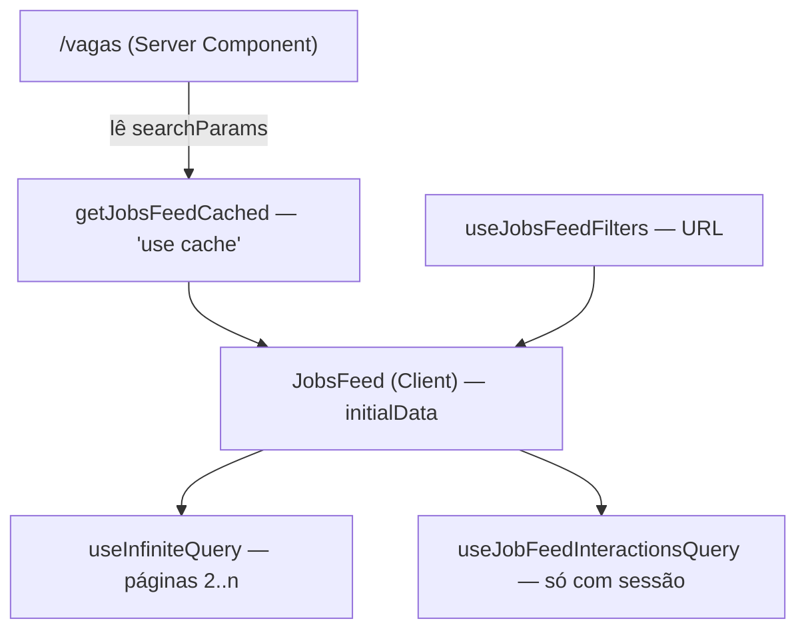

# Design técnico — Feed de Vagas (`emp-feed-vagas`)

Solução para o [`prd.md`](prd.md) v1.0.0. Decisões estruturais estão em
[ADR 0006](../../sdd/adrs/0006-agregado-job-enriquecido.md) e
[ADR 0007](../../sdd/adrs/0007-endpoint-de-feed-dedicado.md).

---

## 1. Contratos de domínio

### 1.1 Enums novos (`EmpregaNet.Domain/Enums/`)

```csharp
public enum WorkModelEnum { NaoSelecionado, OnSite, Hybrid, Remote }

public enum SeniorityEnum { NaoSelecionado, Internship, Junior, MidLevel, Senior, Specialist }

public enum JobAreaEnum
{
    NaoSelecionado, Development, Design, Marketing, Sales, HumanResources,
    Finance, Operations, CustomerSupport, Logistics, Health, Education, Other
}
```

Todos seguem a convenção do repositório: índice `0` é `NaoSelecionado` e cada membro carrega
`[Description]` em pt-BR.

### 1.2 `JobTypeEnum` — reformulação

`JobTypeEnum` passava a acumular dois conceitos: **vínculo/jornada** (`FullTime`, `Internship`…) e
**modalidade de trabalho** (`Remote`). Modalidade sai para `WorkModelEnum`; o enum fica só com
vínculo e ganha os dois que faltavam:

| Índice | Antes | Depois |
| ------ | ----- | ------ |
| 0 | `NaoSelecionado` | `NaoSelecionado` |
| 1–7 | `FullTime` … `Volunteer` | inalterados |
| 8 | `Remote` | **reservado — não reutilizar** |
| 9 | — | `Clt` |
| 10 | — | `Pj` |

O índice 8 fica deliberadamente vago. Reaproveitá-lo faria qualquer linha que escapasse ao
data-move (réplica, backup restaurado, ambiente esquecido) passar a significar `Clt` em silêncio.
Um buraco no enum custa nada; uma vaga remota virar CLT sem ninguém notar custa caro.

### 1.3 Value object `JobLocation`

```csharp
public sealed class JobLocation
{
    public required string City { get; set; }
    public required UF State { get; set; }
    public string Country { get; set; } = "BR";
}
```

Owned type mapeado **na tabela `Jobs`**, não herdado de `Company`. Duas razões: a vaga pode ser em
cidade diferente da sede, e o filtro geográfico precisa de coluna indexável em `Jobs` — derivá-la da
empresa tornaria o join obrigatório em toda consulta do feed.

Vaga 100% remota mantém cidade/UF de referência (base da contratação), como fazem LinkedIn e Indeed.
A modalidade é quem diz que é remota.

### 1.4 `Job` — forma final

```csharp
public class Job : BaseEntity, IAggregateRoot
{
    public long CompanyId { get; private set; }
    public string Title { get; private set; }
    public string? Summary { get; private set; }          // novo — até 280 chars
    public string Description { get; private set; }
    public decimal? SalaryMin { get; private set; }        // era `Salary`
    public decimal? SalaryMax { get; private set; }        // novo
    public bool SalaryDisclosed { get; private set; }      // novo
    public JobTypeEnum JobType { get; private set; }
    public WorkModelEnum WorkModel { get; private set; }   // novo
    public SeniorityEnum Seniority { get; private set; }   // novo
    public JobAreaEnum Area { get; private set; }          // novo
    public JobLocation Location { get; private set; }      // novo
    public List<string> Technologies { get; private set; } // novo — text[]
    public List<string> Benefits { get; private set; }     // novo — text[]
    public DateTimeOffset PublishedAt { get; private set; }
    public bool IsActive { get; private set; }
}
```

`Technologies`/`Benefits` são `List<string>` com setter privado, mutados apenas por `UpdateJob`.
`IReadOnlyList<string>` com backing field seria mais estrito, mas obriga o EF a materializar por
campo e complica a tradução do operador de sobreposição de arrays. A encapsulação que importa —
não haver caminho público de mutação fora do agregado — está preservada.

O vocabulário de tecnologias e benefícios é uma **lista curada em constante** (`JobVocabulary` na
Application), não uma tabela de catálogo. Duas entidades, dois repositórios e seeds para o que hoje
é um conjunto fechado de strings seria custo sem retorno (KISS/YAGNI da backend-skill). Promover a
tabela quando houver necessidade real de gestão pelo utilizador.

---

## 2. Persistência

### 2.1 Colunas e tipos (`Jobs`)

| Coluna | Tipo | Nota |
| ------ | ---- | ---- |
| `Summary` | `varchar(280)` null | |
| `SalaryMin` | `numeric(10,2)` null | renomeada de `Salary` |
| `SalaryMax` | `numeric(10,2)` null | |
| `SalaryDisclosed` | `boolean` not null default `true` | |
| `WorkModel`, `Seniority`, `Area` | `integer` not null default `0` | |
| `City` | `varchar(100)` not null | owned `Location` |
| `State` | `integer` not null | owned `Location` (UF) |
| `Country` | `varchar(2)` not null default `'BR'` | owned `Location` |
| `Technologies`, `Benefits` | `text[]` not null default `'{}'` | |
| `SearchVector` | `tsvector` gerado, stored | shadow property |

### 2.2 Busca full-text

`unaccent()` não é `IMMUTABLE`, então não pode entrar direto numa coluna gerada. A saída correta é
uma configuração de busca que já aplique o dicionário:

```sql
CREATE EXTENSION IF NOT EXISTS unaccent;
CREATE EXTENSION IF NOT EXISTS pg_trgm;

CREATE TEXT SEARCH CONFIGURATION pt_unaccent ( COPY = portuguese );
ALTER TEXT SEARCH CONFIGURATION pt_unaccent
  ALTER MAPPING FOR hword, hword_part, word
  WITH unaccent, portuguese_stem;
```

`to_tsvector('pt_unaccent', …)` é imutável e serve à coluna gerada:

```sql
ALTER TABLE "Jobs" ADD COLUMN "SearchVector" tsvector
GENERATED ALWAYS AS (
    setweight(to_tsvector('pt_unaccent', coalesce("Title", '')), 'A') ||
    setweight(to_tsvector('pt_unaccent', coalesce("Summary", '')), 'B') ||
    setweight(to_tsvector('pt_unaccent', array_to_string("Technologies", ' ')), 'B') ||
    setweight(to_tsvector('pt_unaccent', array_to_string("Benefits", ' ')), 'C') ||
    setweight(to_tsvector('pt_unaccent', coalesce("Description", '')), 'D')
) STORED;
```

Os pesos alimentam `ts_rank` e são o que dá sentido à ordenação por relevância: título vale mais que
descrição.

**Nome da empresa** não entra no vetor — está noutra tabela e coluna gerada não cruza tabelas. A
busca por empresa é uma condição adicional no join (`ILIKE`), apoiada num índice trigram em
`Companies."CompanyName"`.

`SearchVector` é **shadow property** configurada na Infra (`builder.Property<NpgsqlTsVector>(…)`).
Mantém `NpgsqlTypes` fora do Domain e é consultada com `EF.Property<NpgsqlTsVector>(j, "SearchVector")`.

### 2.3 Índices

| Índice | Definição | Serve |
| ------ | --------- | ----- |
| `IX_Jobs_Feed` | `(IsDeleted, IsActive, PublishedAt DESC)` | predicado + ORDER BY padrão do feed |
| `IX_Jobs_Location` | `(State, City)` | filtro geográfico |
| `IX_Jobs_SalaryMax` | `(SalaryMax DESC)` | ordenação por salário |
| `IX_Jobs_SearchVector` | GIN sobre `SearchVector` | busca textual |
| `IX_Jobs_Technologies` | GIN sobre `Technologies` | sobreposição de arrays |
| `IX_Jobs_Benefits` | GIN sobre `Benefits` | sobreposição de arrays |
| `IX_Companies_Name_Trgm` | GIN `gin_trgm_ops` sobre `CompanyName` | busca por empresa |

**Não** foram criados índices de coluna única para `WorkModel`, `Seniority`, `Area` e `JobType`.
São enums de baixa cardinalidade (3 a 12 valores): um btree neles é ignorado pelo planeador na
maioria dos casos e só adiciona custo de escrita. O predicado base do feed já é coberto por
`IX_Jobs_Feed`, e o Postgres combina os demais por bitmap scan quando compensa.

### 2.4 Migration — data-move

Ordem obrigatória dentro da migration:

1. `CREATE EXTENSION` + `CREATE TEXT SEARCH CONFIGURATION`.
2. Adicionar colunas novas com defaults.
3. Renomear `Salary` → `SalaryMin`.
4. **Mover modalidade:** `UPDATE "Jobs" SET "WorkModel" = 3, "JobType" = 1 WHERE "JobType" = 8;`
   (`Remote` → `WorkModel.Remote`, vínculo assume `FullTime`.)
5. **Backfill de localização** a partir do endereço da empresa:
   ```sql
   UPDATE "Jobs" j
      SET "City" = c."City", "State" = c."State", "Country" = 'BR'
     FROM "Companies" c
    WHERE c."Id" = j."CompanyId";
   ```
   Sem isto, toda vaga anterior à feature sai de qualquer filtro geográfico (CA-21).
6. Coluna gerada `SearchVector` e índices — por último, depois dos dados povoados.

`Down` reverte na ordem inversa, incluindo `JobType = 8` para as vagas com `WorkModel = Remote`.

> **Gate humano:** a migration altera dados de produção. Gerar e revisar antes de qualquer
> `dotnet ef database update`.

---

## 3. Application

### 3.1 Filtro (Domain)

`JobFeedFilter` é um record no Domain — o repositório precisa dele e o Domain não pode depender da
Application:

```csharp
public sealed record JobFeedFilter(
    string? Search,
    IReadOnlyCollection<string> Cities,
    IReadOnlyCollection<UF> States,
    IReadOnlyCollection<WorkModelEnum> WorkModels,
    IReadOnlyCollection<JobTypeEnum> JobTypes,
    IReadOnlyCollection<SeniorityEnum> Seniorities,
    IReadOnlyCollection<JobAreaEnum> Areas,
    IReadOnlyCollection<string> Technologies,
    IReadOnlyCollection<string> Benefits,
    IReadOnlyCollection<long> CompanyIds,
    decimal? SalaryMin,
    decimal? SalaryMax,
    DateTimeOffset? PublishedAfter,
    JobFeedSortEnum Sort,
    int Page,
    int Size);
```

`PublishedAfter` chega já resolvido como instante — a tradução de "hoje"/"últimos 7 dias" para data
é do handler, não do repositório. Isso mantém o "agora" fora do SQL e testável.

### 3.2 Read model

```csharp
public sealed record JobFeedProjection(
    long Id, string Title, string? Summary,
    long CompanyId, string CompanyName, string? CompanyLogoUrl,
    string City, UF State, string Country,
    decimal? SalaryMin, decimal? SalaryMax, bool SalaryDisclosed,
    JobTypeEnum JobType, WorkModelEnum WorkModel,
    SeniorityEnum Seniority, JobAreaEnum Area,
    IReadOnlyList<string> Technologies, IReadOnlyList<string> Benefits,
    DateTimeOffset PublishedAt, int ApplicationsCount, bool IsActive);
```

Projeção enxuta: `Description` **não** trafega no feed (o resumo basta; o texto completo fica no
detalhe). Menos bytes por cartão, menos memória por página.

`ApplicationsCount` vem de subquery correlacionada dentro do mesmo `Select` — o EF gera um
sub-select, não uma consulta por linha. Nenhum N+1.

### 3.3 Repositório

```csharp
Task<ListDataPagination<JobFeedProjection>> GetFeedAsync(JobFeedFilter filter, CancellationToken ct);
```

Semântica dos filtros:

| Filtro | Semântica |
| ------ | --------- |
| Multi-valor (cidades, modalidades, tecnologias…) | **OR** interno, **AND** entre grupos |
| Tecnologias / benefícios | sobreposição de arrays (`&&`), usa o GIN |
| Faixa salarial | **interseção de intervalos**: `SalaryMax >= filtro.Min AND SalaryMin <= filtro.Max`. Vaga com `SalaryDisclosed = false` só aparece quando nenhum limite salarial está ativo — filtrar por salário e devolver "a combinar" seria mentir sobre o resultado |
| Busca | `SearchVector @@ websearch_to_tsquery('pt_unaccent', termo)` **OU** `CompanyName ILIKE %termo%` |

Ordenação (desempate sempre por `Id DESC`, para paginação estável):

| `sort` | ORDER BY |
| ------ | -------- |
| `recent` (padrão) | `PublishedAt DESC` |
| `salary` | `SalaryMax DESC NULLS LAST, SalaryMin DESC NULLS LAST` |
| `relevance` | `ts_rank(SearchVector, query) DESC` — sem busca ativa, degrada para `recent` |
| `company` | `CompanyName ASC` |
| `location` | `State ASC, City ASC` |

### 3.4 Handlers

- `GetJobsFeedQuery` → `ListDataPagination<JobFeedItemViewModel>`. Resolve a janela temporal, monta
  o `JobFeedFilter`, chama o repositório, mapeia. **Sempre** força `IsActive = true` e
  `IsDeleted = false`: o feed é público e não tem modo privilegiado (PRD §2).
- `GetJobsFeedValidator : BasePaginatedQueryValidator<>` — `Size` ≤ 50, `Search` ≤ 120 chars, no
  máximo 20 itens por filtro multi-valor, `SalaryMin ≤ SalaryMax`.
- `GetJobFeedInteractionsQuery(IReadOnlyCollection<long> JobIds)` → `JobFeedInteractionsViewModel`.
  Uma consulta `WHERE JobId IN (…) AND UserId = @me`, teto de 100 ids.

---

## 4. HTTP

### 4.1 `GET /api/jobs/feed` — anónimo, cacheado

Parâmetros (multi-valor repetindo a chave: `?workModel=Remote&workModel=Hybrid`):

| Parâmetro | Tipo | Notas |
| --------- | ---- | ----- |
| `search` | string | ≤ 120 chars |
| `city` | string[] | |
| `state` | UF[] | nome do enum (`MG`) |
| `workModel` | string[] | `OnSite` \| `Hybrid` \| `Remote` |
| `jobType` | string[] | nomes de `JobTypeEnum` |
| `seniority` | string[] | |
| `area` | string[] | |
| `technology` | string[] | |
| `benefit` | string[] | |
| `companyId` | long[] | |
| `salaryMin` / `salaryMax` | decimal | |
| `publishedWithin` | enum | `today` \| `h24` \| `d3` \| `d7` \| `d15` \| `d30` |
| `sort` | enum | `recent` \| `salary` \| `relevance` \| `company` \| `location` |
| `page` / `size` | int | `size` ≤ 50, padrão 20 |

`today` (desde 00:00 de Brasília) e `h24` (últimas 24 horas) são janelas diferentes — por isso é
enum, não um inteiro de dias.

**200** — `ListDataPagination<JobFeedItemViewModel>`:

```json
{
  "page": 1,
  "totalPages": 7,
  "totalItems": 132,
  "data": [
    {
      "id": 42,
      "title": "Pessoa Desenvolvedora .NET Pleno",
      "summary": "Squad de produto, APIs .NET 10 e front em Next.js.",
      "company": { "id": 3, "name": "Acme Tecnologia", "logoUrl": null },
      "location": { "city": "Extrema", "state": "MG", "country": "BR" },
      "workModel": "Hybrid",
      "jobType": "Clt",
      "seniority": "MidLevel",
      "area": "Development",
      "salary": { "min": 6000.00, "max": 9000.00, "disclosed": true },
      "technologies": [".NET", "React", "PostgreSQL"],
      "benefits": ["Vale Refeição", "Plano de Saúde"],
      "publishedAt": "2026-07-28T13:45:00+00:00",
      "applicationsCount": 12,
      "isActive": true
    }
  ]
}
```

Duas escolhas de contrato, ambas divergentes do resto da API e ambas deliberadas:

1. **Enums como nome, não inteiro.** `"workModel": "Hybrid"` em vez de `2`. O cliente mapeia nome →
   rótulo por uma fonte única; inteiro obriga a manter a ordem do enum espelhada no frontend, que é
   exatamente o que `normalizeJobType` teve de resolver na marra. Implementado como propriedade
   `string` no view model — sem mexer no serializador global.
2. **`publishedAt` em ISO-8601 UTC.** O resto da API devolve data já formatada em pt-BR
   (`BaseViewModel.CreatedAt`). O cartão precisa calcular "há 3 dias", o que exige um instante, não
   um texto. Por isso `JobFeedItemViewModel` **não** herda de `BaseViewModel`.

**400** — `DomainError` de validação.

Cache: `[OutputCache(PolicyName = OutputCachePolicies.PublicCatalog)]`. A política já usa
`QueryKeys = "*"` e aplica tag de entidade, então cada combinação de filtros tem entrada própria e a
invalidação existente por mutação de vaga continua valendo.

### 4.2 `GET /api/jobs/feed/interactions` — autenticado

`?ids=1&ids=2…` (máx. 100).

```json
{ "appliedJobIds": [1, 7] }
```

**Por que separado do feed:** o feed é cacheado publicamente. Injetar estado por utilizador na mesma
resposta obrigaria a variar o cache por `userId`, multiplicando entradas por utilizador e destruindo
o ganho — ou, pior, serviria a resposta de um utilizador a outro. Endpoint separado mantém o feed
anónimo e cacheável e resolve o estado pessoal num round-trip em lote.

**401** quando não há sessão. O frontend só chama este endpoint com sessão ativa.

### 4.3 Contratos alterados

`CreateJobCommand` / `UpdateJobCommand` ganham os campos novos e trocam `Salary` por
`SalaryMin`/`SalaryMax`/`SalaryDisclosed`. **É mudança incompatível** em `POST`/`PUT /api/jobs`. O
único consumidor é o formulário de recrutamento deste monorepo, atualizado na mesma entrega.

`GET /api/jobs` e `GET /api/jobs/{id}` permanecem — a tela de recrutamento depende deles.
`JobViewModel` ganha os campos novos de forma aditiva.

---

## 5. Frontend

### 5.1 Fluxo de renderização



A primeira página é resolvida no servidor e entregue como `initialData` do `useInfiniteQuery`: o
HTML inicial já traz vagas (CA-20) e o cliente não refaz a requisição. O `<Suspense>` acima do
`AppShell` no layout `(public)` cobre o acesso dinâmico a `searchParams` exigido por
`cacheComponents`; o segmento ganha `loading.tsx` próprio.

### 5.2 Estrutura de ficheiros

```text
shared/schema/job-vocabulary.ts        # fonte única: enums, rótulos pt-BR, faixas salariais
features/vagas/
├── service/                           # feed público (deixa de importar de recrutamento/)
│   ├── jobs-feed-api.ts
│   ├── jobs-feed-schema.ts
│   ├── jobs-feed-keys.ts
│   ├── jobs-feed-queries.ts
│   ├── jobs-feed-server.ts            # 'use cache' — fora do barrel
│   └── index.ts
├── feed/
│   ├── jobs-feed.tsx                  # orquestrador
│   ├── use-jobs-feed-filters.ts       # estado na URL
│   ├── job-card/                      # card + header + highlights + actions + skeleton
│   ├── feed-search-bar.tsx
│   ├── feed-filters-form.tsx          # campos — um só, dois containers
│   ├── feed-filters-panel.tsx         # desktop
│   ├── feed-filters-drawer.tsx        # mobile (Radix Dialog)
│   ├── feed-active-chips.tsx
│   ├── feed-sort-select.tsx
│   └── feed-empty-state.tsx
└── detail/                            # atualizado para os campos novos
```

O vocabulário vai para `shared/schema/` seguindo o precedente de `user-types.ts`: é consumido pelo
feed, pelo detalhe e pelo formulário de recrutamento, e ter duas listas de rótulos divergindo é
exatamente o defeito que a fonte única evita.

### 5.3 Estado na URL

`useJobsFeedFilters` trata a URL como fonte única de verdade: lê com `useSearchParams`, valida com
Zod, escreve com `router.replace(…, { scroll: false })`. Sem dependência nova — `nuqs` não está
instalado e `URLSearchParams` resolve. Só a busca textual passa por `useDebouncedValue` (já existe
em `shared/hooks`); mudar um filtro é intencional e aplica na hora.

### 5.4 Performance da lista

Sem virtualização nesta fase, conforme o PRD ("virtualização quando necessário"):
`content-visibility: auto` + `contain-intrinsic-size` nos cartões deixa o browser pular o layout e a
pintura do que está fora do viewport, com custo zero de dependência. `@tanstack/react-virtual` fica
como saída se a medição mostrar necessidade — decisão adiada por falta de evidência, não por
preferência.

`useInfiniteQuery` com `placeholderData` mantém a lista anterior visível durante a troca de filtros,
evitando o flash de lista vazia.

### 5.5 Acessibilidade

`role="feed"` com `aria-busy` durante o carregamento; cada cartão é `article` com
`aria-labelledby` no cargo e `aria-posinset`/`aria-setsize`. Novos lotes são anunciados por região
`aria-live="polite"`. O drawer Radix já prende e devolve o foco. Chips de filtro trazem
`aria-label` explícito de remoção. Animações limitam-se a `transform`/`opacity` e são neutralizadas
pelo bloco `prefers-reduced-motion` global de `globals.scss`.

---

## 6. Riscos

| Risco | Mitigação |
| ----- | --------- |
| Migration com data-move em produção | Revisão humana antes do `database update`; `Down` reverte o movimento |
| `CREATE EXTENSION` exige privilégio | Falha cedo e explicitamente na migration; alternativa é FTS sem `unaccent` |
| Provider `InMemory` não suporta `tsvector` nem operadores de `text[]` | Busca e filtros de array cobertos por unit test com repositório mockado; a lacuna fica registada em [`spec.md`](spec.md) em vez de mascarada |
| Vagas antigas sem área/senioridade/tecnologias | Campos opcionais; a vaga continua listável. Só a localização tem backfill, por ser filtro de primeira ordem |
| Contrato de escrita de vaga quebrado | Consumidor único e interno, atualizado na mesma entrega |
