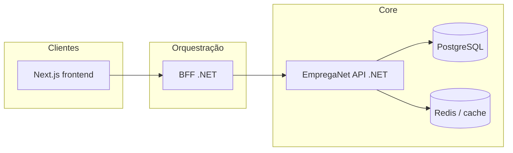

# EmpregaNet — Spec-Driven Development (SDD)

Documento vivo: descreve **como** especificação, implementação e validação se alinham no monorepo **EmpregaNet**, com ênfase em contratos claros, gates de qualidade e uso disciplinado de **agentes de IA** como aceleradores—not substitutos de julgamento humano.

**Audiência**: equipa de produto e engenharia, arquitetos, e quem orquestra trabalho com IA (Cursor, reviews automatizados, etc.).

---

## 1. Filosofia e princípios

### 1.1 O que é SDD neste repositório

**Spec-Driven Development**: toda entrega significativa começa com **artefactos de especificação verificáveis** (comportamento esperado, contratos, critérios de aceitação), prossegue com **implementação rastreável** à spec, e fecha com **evidência** (testes, revisão, métricas quando aplicável). Não é documentação ornamental: a spec **orienta** o código e **detecta deriva**.

### 1.2 Princípios (arquitectura + IA)

| Princípio | Implicação prática |
|-----------|-------------------|
| **Single source of truth** | Comportamento de negócio: linguagem ubíqua + testes/regras na Application (.NET). Contrato HTTP: ViewModels/DTOs estáveis; no frontend, **Zod** espelha o contrato consumido. |
| **Human-in-the-loop** | IA (agentes em `docs/agents/`) acelera redacção, implementação e revisão; **merge** e decisões de risco ficam com humanos. |
| **Least power** | Preferir o mecanismo mais simples que satisfaz a spec (YAGNI, KISS, DRY). |
| **Traceability** | Cada PR liga-se a uma spec ou ticket com critérios de aceitação mensuráveis. |
| **Defence in depth** | Validação na API, saneamento na fronteira do cliente, autorização explícita (RBAC) em caminhos sensíveis. |

### 1.3 Visão do sistema (C4 model — nível contentor)



- **`frontend/`**: experiência utilizador, sessão/cookies, RBAC de UI, chamadas ao BFF ou API conforme configuração.
- **`bff/`**: agregação/orquestração HTTP para o cliente; reduz acoplamento e pode simplificar contratos públicos.
- **`backend/`**: domínio, casos de uso, persistência (EF Core), autenticação/autorização da API.

---

## 2. Camadas de especificação

Ordem sugerida de riqueza vs custo de manutenção:

1. **Critérios de aceitação** (Gherkin (linguagem estruturada) opcional, bullets obrigatórios no ticket/PR): dado/quando/então em linguagem de negócio.
2. **Contrato de API** (OpenAPI/Swagger se gerado; caso contrário **documentação de endpoints** + exemplos JSON alinhados aos ViewModels).
3. **Schemas Zod** no frontend para payloads que o UI consome ou envia (paridade com a API).
4. **Testes automatizados**: unitários na Application; integração para EF/HTTP; e2e mínimos para fluxos críticos (login, candidatura, etc., conforme produto).

**Regra de ouro**: alterar contrato sem actualizar consumidor + spec + testes relevantes é **deriva intencional**, deve ser explícita no changelog do PR.

---

## 3. Fluxo de trabalho SDD (operacional)

### Fase A — Descoberta e especificação

1. **Problema e não-objectivos**: o que não será feito neste incremento.
2. **Personas e permissões**: que papéis (RBAC) afectam a feature.
3. **Casos de uso** e **estados** (vazio, erro, loading, sucesso).
4. **Decisões de arquitectura leves**: se a decisão tiver trade-offs duradouros, registe **ADR** curto em `docs/sdd/adrs/` (template abaixo).

### Fase B — Desenho técnico (quando necessário)

- Backend: (Clean arch) Domain / Application / Infra / Api; comandos e queries com mediator interno do projecto.
- Frontend: pastas por feature, serviços e schemas por domínio.
- Orquestração IA: consultar `docs/agents/meta-agent.md` para pedidos amplos; `dotnet-architect` para novas fronteiras; `frontend-engineer` para UI.

### Fase C — Implementação

- Seguir `docs/skills/backend-skill/SKILL.md` e `docs/skills/frontend-skill/SKILL.md`.
- Commits pequenos, mensagens que referenciam o ticket/spec.

### Fase D — Verificação (gates)

| Gate | Mínimo esperado |
|------|-----------------|
| **Build** | `dotnet build` soluções API e BFF; `pnpm build` ou `pnpm lint` no frontend conforme CI. |
| **Testes** | Novos caminhos cobertos na Application ou integração; regressão verde. |
| **Segurança** | Sem secrets no repo; validação de input; autorização nos endpoints sensíveis. |
| **Revisão** | Humano + opcional passagem mental alinhada a `docs/agents/code-reviewer.md`. |

### Fase E — Entrega e observabilidade

- Métricas/logs para erros 5xx e latência em endpoints alterados.
- Feature flags apenas se o processo de release do projecto as usar.

---

## 4. ADR (Architecture Decision Record) — template

Criar ficheiro `docs/sdd/adrs/NNNN-titulo-curto.md`:

```markdown
# ADR NNNN: Título

## Status
Proposto | Aceite | Depreciado

## Contexto
Que forças e restrições levaram a esta decisão?

## Decisão
O que foi decidido (uma frase + bullets se necessário).

## Consequências
Positivas e negativas; o que fica proibido ou obrigatório daqui em diante.
```

---

## 5. Integração com agentes de IA (mapa mental)

Os prompts em `docs/agents/` são **perfis cognitivos** especializados. Use-os para reduzir erro de “generalista” em tarefas exigentes:

| Fase / necessidade | Agente sugerido |
|--------------------|-----------------|
| PR ou diff | `code-reviewer` |
| Bug ou incidente | `debug-specialist` |
| Novo módulo API / fronteiras | `dotnet-architect` → `dotnet-implementer` |
| Código .NET concreto | `dotnet-implementer` |
| UI/UX | `frontend-engineer` |
| Testes | `test-engineer` |
| Performance com números ou suspeita forte | `performance-optimizer` |
| Pedido vago ou multi-domínio | `meta-agent` |

A regra está em `.cursor/rules/empreganet-docs-context.mdc` força o contexto deste documento e das skills em sessões de edição.

---

## 6. IA como “co-arquitecto” (boas práticas)

1. **Context packing**: antes de pedir implementação longa, anexe paths relevantes, contrato JSON de exemplo, e critérios de aceitação.
2. **Verificação adversarial**: peça explicitamente ao `code-reviewer` o que falhou na primeira versão.
3. **Sem alucinação de stack**: o backend usa mediator **interno** em `EmpregaNet.Domain.Libs.Mediator`, não assumir MediatR NuGet sem verificar.
4. **Contratos duplos**: mudança na API → actualizar Zod/DTOs no cliente na mesma entrega quando possível.

---

## 7. Roadmap deste SDD

- Preencher `docs/sdd/adrs/` quando surgirem decisões estruturais (ex.: estratégia BFF vs chamada directa, política de cache).
- Opcional: gerar ou anexar OpenAPI a partir da API para fonte única de contrato HTTP.
- Opcional: definir um conjunto mínimo de cenários e2e “golden path” alinhados ao negócio EmpregaNet.

---

## 8. Referências internas

| Recurso | Path |
|---------|------|
| Regras (sempre aplicável) | `.cursor/rules/empreganet-docs-context.mdc` |
| Agentes | `docs/agents/*.md` |
| Skills | `docs/skills/*/SKILL.md` |
| SDD | `docs/sdd/EMPREGANET-SDD.md` |

---

*Última actualização conceitual: alinhada ao monorepo EmpregaNet (backend .NET Clean Architecture, BFF .NET, frontend Next.js 15 + React 19).*
